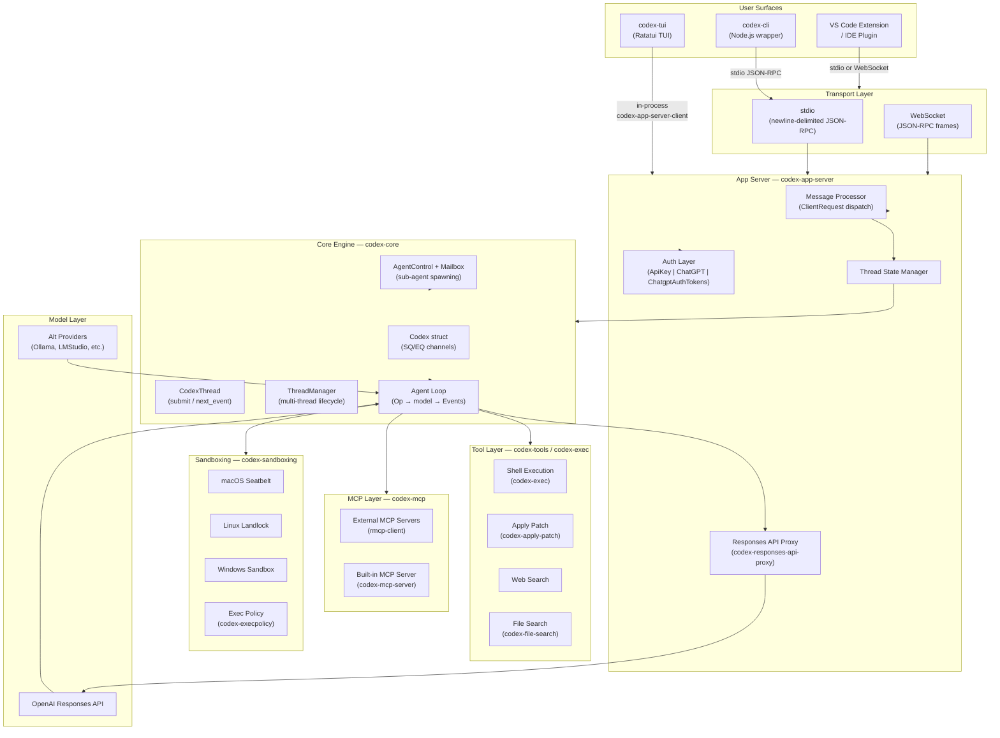
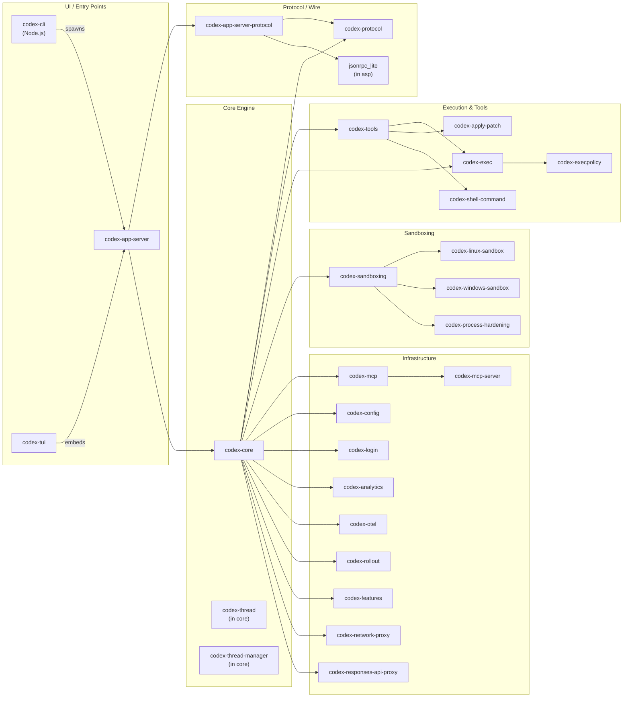

# OpenAI Codex — Architecture Overview

> **Last updated:** referencing [`github.com/openai/codex`](https://github.com/openai/codex) `main` branch.

> Codex is a lightweight, locally-executed coding agent. It exposes a terminal UI (TUI), a headless CLI, and an app server that external editors (VS Code, IDE plugins) can connect to over stdio or WebSocket.

---

## 1. Introduction

Codex runs entirely on the developer's machine. When you type a request, the core engine packages that request into an **Op**, sends it to the agent loop running in a background thread, calls the OpenAI Responses API (or an alternative provider), and streams **Events** back to whichever surface is attached — the TUI, a headless script, or an IDE extension.

Key design properties:

- **Local-first.** No cloud intermediary is required for the agent loop. Only the model API call leaves the machine.
- **Surface-agnostic.** The `codex-core` crate is independent of any UI. TUI, CLI, and app-server all consume the same `Op`/`Event` channel pair.
- **Sandboxed by default.** Every tool call runs through an approval and sandboxing layer before touching the filesystem or network.
- **Protocol-stable.** Wire types live in pure data crates (`codex-protocol`, `codex-app-server-protocol`) with no dependency on runtime crates, so external clients can be generated in any language.

---

## 2. System Architecture



---

## 3. Crate Dependency Map



---

## 4. Technology Stack

| Concern | Technology | Notes |
|---|---|---|
| **Primary language** | Rust (2021 edition) | All `codex-rs/` crates |
| **CLI wrapper** | Node.js (TypeScript) | `codex-cli/` — thin launcher and npm package |
| **TUI framework** | [Ratatui](https://ratatui.rs/) | Terminal rendering in `codex-tui` |
| **Async runtime** | [Tokio](https://tokio.rs/) | Used throughout `codex-core` and `codex-app-server` |
| **HTTP client** | `reqwest` + `eventsource-stream` | SSE streaming to Responses API |
| **WebSocket** | `tokio-tungstenite` | v2 model client and app-server transport |
| **IPC / wire protocol** | JSON-RPC 2.0 (newline-delimited) | stdio and WebSocket transports |
| **Serialization** | `serde` + `serde_json` | `camelCase` on v2 wire, `snake_case` internally |
| **Schema generation** | `schemars` (JSON Schema) + `ts-rs` (TypeScript) | Run `just write-app-server-schema` |
| **Sandboxing (macOS)** | `seatbelt` (sandbox-exec profiles) | `codex-sandboxing` |
| **Sandboxing (Linux)** | `landlock` syscall + `seccomp` | `codex-linux-sandbox` |
| **Sandboxing (Windows)** | Windows Job Objects + AppContainer | `codex-windows-sandbox-rs` |
| **MCP integration** | `rmcp-client` (Model Context Protocol) | `codex-mcp`, `codex-rmcp-client` |
| **Tracing / telemetry** | OpenTelemetry (`codex-otel`) + `tracing` | OTLP export |
| **Build system** | Cargo (primary) + Bazel (CI/remote cache) | `justfile` for common tasks |
| **Package manager (JS)** | pnpm | Workspace at repo root |

---

## 5. Domain Navigation

| # | Domain | File | Key Crates |
|---|---|---|---|
| 01 | Core Engine & Agent Loop | [01-core-engine.md](./01-core-engine.md) | `codex-core`, `codex-protocol` |
| 02 | API & Protocol Layer | [02-api-protocol.md](./02-api-protocol.md) | `codex-app-server-protocol`, `codex-protocol` |
| 03 | App Server | [03-app-server.md](./03-app-server.md) | `codex-app-server`, `codex-app-server-client` |
| 04 | Security & Sandboxing | [04-security-sandboxing.md](./04-security-sandboxing.md) | `codex-sandboxing`, `codex-linux-sandbox`, `codex-windows-sandbox-rs` |
| 05 | Command Execution & Exec Policy | [05-exec-policy.md](./05-exec-policy.md) | `codex-execpolicy`, `codex-exec`, `codex-apply-patch` |
| 06 | Authentication & Identity | [06-auth-login.md](./06-auth-login.md) | `codex-login`, `codex-keyring-store`, `codex-backend-client` |
| 07 | Tool System & LLM Integration | [07-tools-system.md](./07-tools-system.md) | `codex-tools`, `codex-responses-api-proxy`, `codex-connectors` |
| 08 | Model Context Protocol (MCP) | [08-mcp.md](./08-mcp.md) | `codex-mcp`, `codex-mcp-server`, `codex-rmcp-client` |
| 09 | CLI, TUI & User Interface | [09-ui-cli-tui.md](./09-ui-cli-tui.md) | `codex-tui`, `codex-cli` (Node.js), `codex-file-search` |
| 10 | Configuration, State & Features | [10-config-state.md](./10-config-state.md) | `codex-config`, `codex-features`, `codex-state`, `codex-rollout` |
| 11 | Skills & Plugin System | [11-skills-plugins.md](./11-skills-plugins.md) | `codex-skills`, `codex-core-skills`, `codex-plugin` |
| 12 | Observability & Cloud Tasks | [12-observability.md](./12-observability.md) | `codex-otel`, `codex-analytics`, `codex-cloud-tasks` |

---

## 6. Repository Structure

The repository has two first-class source roots and one shared tooling layer:

```
openai/codex/
├── codex-rs/                  # All Rust crates (the engine, server, TUI, tools)
│   ├── core/                  # codex-core — agent loop, session, model client
│   ├── protocol/              # codex-protocol — pure data/type crate, no runtime deps
│   ├── app-server/            # codex-app-server — JSON-RPC server (stdio + WebSocket)
│   ├── app-server-protocol/   # codex-app-server-protocol — wire types, schema gen
│   ├── tui/                   # codex-tui — Ratatui terminal UI
│   ├── cli/                   # codex-cli (Rust binary, minimal — JS wrapper is primary)
│   ├── exec/                  # codex-exec — shell command execution
│   ├── execpolicy/            # codex-execpolicy — approval policy engine
│   ├── sandboxing/            # codex-sandboxing — platform sandbox orchestration
│   ├── linux-sandbox/         # Linux landlock + seccomp sandbox
│   ├── tools/                 # codex-tools — tool registry
│   ├── mcp/                   # codex-mcp — MCP client integration
│   ├── mcp-server/            # codex-mcp-server — built-in MCP server
│   ├── login/                 # codex-login — OAuth + API key auth
│   ├── config/                # codex-config — config loading and merging
│   ├── analytics/             # codex-analytics — telemetry events
│   ├── otel/                  # codex-otel — OpenTelemetry init
│   ├── rollout/               # codex-rollout — conversation persistence
│   ├── responses-api-proxy/   # Responses API proxy (for ChatGPT backend routing)
│   └── ...                    # 40+ additional utility crates
│
├── codex-cli/                 # Node.js / TypeScript CLI package
│   ├── src/                   # TypeScript source
│   └── package.json           # npm package definition
│
├── sdk/                       # TypeScript SDK (client bindings, generated types)
├── docs/                      # Project documentation (you are here)
├── justfile                   # Task runner (`just build`, `just test`, etc.)
└── Cargo.toml                 # Cargo workspace root (codex-rs/)
```

> **Note:** `codex-rs/` is itself a Cargo workspace. All Rust crate names use the `codex-` prefix by convention, but directory names often omit it (e.g., `core/` → crate `codex-core`, `tui/` → crate `codex-tui`).
