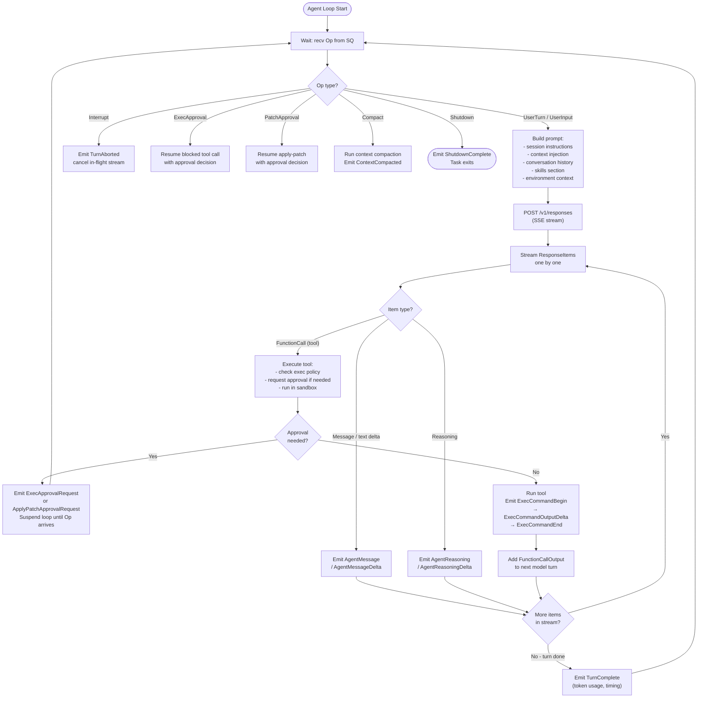
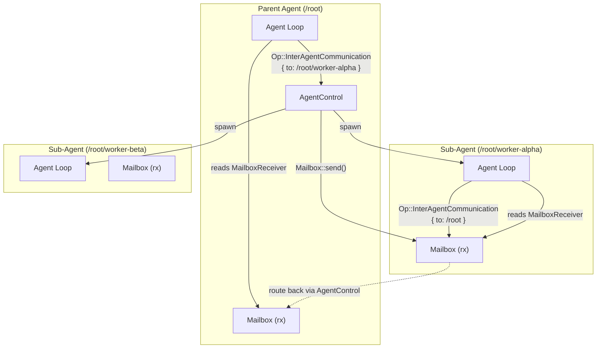

# Core Engine & Agent Loop

> **Last updated:** referencing [`github.com/openai/codex`](https://github.com/openai/codex) `main` branch.

> The `codex-core` crate is the heart of the system. It owns the agent loop, model client, session state, thread lifecycle, and sub-agent orchestration. All user-facing surfaces (TUI, app server, CLI) are consumers of the `Op`/`Event` channel pair that `codex-core` exposes.

---

## 1. Overview

`codex-core` is deliberately surface-agnostic. It has no knowledge of HTTP transports, terminal rendering, or IDE protocols. Its public contract is:

- Accept **submissions** (`Op` values) from the caller.
- Run the agent loop, call the model, invoke tools, manage sandboxes.
- Emit **events** (`EventMsg` values wrapped in `Event`) back to the caller.

This contract is implemented through the **Submission Queue / Event Queue (SQ/EQ) pattern** — an async message-passing architecture built on bounded `async_channel` channels. The caller never calls into the agent loop directly; it only pushes `Op`s and pulls `Event`s.

---

## 2. SQ/EQ Pattern

The SQ/EQ pattern decouples the user-facing surface from the agent loop. Submissions flow in on one channel; events flow out on another.

```mermaid
sequenceDiagram
    participant Caller as Caller (TUI / App Server)
    participant SQ as Submission Queue (async_channel)
    participant Loop as Agent Loop (Tokio task)
    participant Model as Model API (OpenAI)
    participant Tools as Tools / Sandbox
    participant EQ as Event Queue (async_channel)

    Caller->>SQ: submit(Op::UserTurn { ... })
    Note over SQ: bounded channel, back-pressure if full

    Loop->>SQ: recv() — picks up Op
    Loop->>Loop: build prompt from history + context
    Loop->>Model: POST /v1/responses (SSE stream)
    Model-->>Loop: stream ResponseItem chunks

    alt Tool call in response
        Loop->>Tools: execute tool (exec / patch / web search)
        Tools-->>Loop: tool output
        Loop->>Model: continue with FunctionCallOutput
    end

    Loop->>EQ: send(Event { msg: TurnComplete, ... })
    EQ-->>Caller: next_event() returns Event
```

The channel pair is created when a `Codex` session is constructed. The `tx_sub` sender is held by the public `submit()` method; the `rx_event` receiver is read by `next_event()`.

---

## 3. Key Types

### `Codex`

The lowest-level session object. Created by `ThreadManager` (or directly in tests). Holds:

| Field | Type | Purpose |
|---|---|---|
| `tx_sub` | `async_channel::Sender<Submission>` | Push `Op`s into the agent loop |
| `rx_event` | `async_channel::Receiver<Event>` | Pull `Event`s out of the agent loop |
| `session` | `Arc<Session>` | Immutable session config (model, sandbox policy, cwd, etc.) |
| `agent_status` | `watch::Receiver<AgentStatus>` | Live status observable (Idle, Thinking, Executing, …) |

Key methods: `submit(op)`, `submit_with_trace(op, trace)`, `steer_input(input, turn_id)`, `next_event()`, `shutdown_and_wait()`.

### `CodexThread`

A thin wrapper around `Codex` that adds rollout recording, file-watch registration, and out-of-band elicitation tracking. This is the type that `ThreadManager` hands to the app server.

```
CodexThread
  ├── codex: Codex                        (channel pair + session)
  ├── rollout_path: Option<PathBuf>       (persisted conversation history)
  ├── out_of_band_elicitation_count       (Mutex<u64>)
  └── _watch_registration: WatchRegistration
```

Public methods mirror `Codex`: `submit()`, `steer_input()`, `next_event()`, `shutdown_and_wait()`.

### `ThreadManager`

Manages the lifecycle of multiple `CodexThread` instances. Responsibilities:

- Spawn new threads with `create_thread()`.
- Fork existing threads (`fork_thread()`), optionally with partial history.
- Route `Op`s to the correct thread by `ThreadId`.
- Watch skills files and notify threads when skills change.
- Record rollout snapshots for session persistence.

`ThreadManager` uses a `HashMap<ThreadId, Arc<CodexThread>>` protected by `tokio::sync::RwLock`.

### `ModelClient` / `ModelClientSession`

HTTP/WebSocket client that handles the Responses API interactions:

- `ModelClient` — connection-level: base URL, auth headers, retry logic.
- `ModelClientSession` — turn-scoped: message history, SSE streaming (`eventsource-stream`), or WebSocket v2 framing.

Supports streaming `ResponseItem` chunks incrementally, enabling the TUI to show token-by-token output.

---

## 4. Agent Loop

The agent loop is a Tokio task spawned per `Codex` instance. It runs in a `select!` loop over:

1. The submission channel (new `Op`s from the caller).
2. The model stream (SSE or WebSocket events from the API).
3. Tool-call results (from `codex-exec`, `codex-apply-patch`, etc.).



---

## 5. Protocol Types

### `Op` Variants

`Op` is the inbound submission type. Every submission is wrapped in a `Submission { id, op, trace }` envelope.

| Variant | Description |
|---|---|
| `UserTurn { inputs, … }` | Start a new turn with user content (text, images, file refs) |
| `UserInput { inputs }` | Add content to the current turn without starting a new one |
| `Interrupt` | Abort the current task; the loop emits `TurnAborted` |
| `ExecApproval { … }` | Approval decision for a pending `ExecApprovalRequest` |
| `PatchApproval { … }` | Approval decision for a pending `ApplyPatchApprovalRequest` |
| `Compact` | Manually trigger context compaction |
| `Review { review_request }` | Enter review mode |
| `Shutdown` | Gracefully shut down the agent loop |
| `InterAgentCommunication { … }` | Route a message from a parent or child sub-agent |
| `AddToHistory { … }` | Inject a message directly into the conversation history |
| `ListMcpTools` | Request the current list of available MCP tools |
| `RefreshMcpServers { config }` | Hot-reload MCP server configuration |
| `ThreadRollback { num_turns }` | Roll back the last N user turns |
| `Undo` | Undo the last patch or exec action |
| `RunUserShellCommand { … }` | Execute a user-initiated shell command outside the turn |
| `RealtimeConversationStart / Audio / Text / Close` | Realtime audio conversation lifecycle |

### `EventMsg` Variants (selected)

`EventMsg` is the outbound event payload. It is wrapped in `Event { id, sub_id, msg }`.

| Category | Variant | Meaning |
|---|---|---|
| **Lifecycle** | `TurnStarted` | Agent has begun processing a turn |
| **Lifecycle** | `TurnComplete` | Turn finished; includes token usage |
| **Lifecycle** | `TurnAborted` | Turn was interrupted |
| **Lifecycle** | `ShutdownComplete` | Agent loop has exited |
| **Lifecycle** | `SessionConfigured` | Session config acknowledged |
| **Content** | `AgentMessage` | Full agent text message |
| **Content** | `AgentMessageDelta` | Streaming text chunk |
| **Content** | `AgentReasoning` | Chain-of-thought reasoning block |
| **Content** | `UserMessage` | The user/system message sent to the model |
| **Execution** | `ExecCommandBegin` | Shell command is about to run |
| **Execution** | `ExecCommandOutputDelta` | Incremental stdout/stderr chunk |
| **Execution** | `ExecCommandEnd` | Shell command finished |
| **Execution** | `PatchApplyBegin / End` | Patch application lifecycle |
| **Approvals** | `ExecApprovalRequest` | Caller must approve or deny a shell command |
| **Approvals** | `ApplyPatchApprovalRequest` | Caller must approve or deny a patch |
| **Context** | `ContextCompacted` | History was compacted |
| **Context** | `ThreadRolledBack` | Conversation rolled back N turns |
| **MCP** | `McpToolCallBegin / End` | MCP tool call lifecycle |
| **MCP** | `McpStartupUpdate / Complete` | MCP server startup progress |
| **Plan** | `PlanUpdate` | Agent updated its structured plan |
| **Error** | `Error(ErrorEvent)` | Unrecoverable error; turn aborted |
| **Warning** | `Warning(WarningEvent)` | Non-fatal warning; turn continues |

### `ResponseItem` Type Hierarchy

`ResponseItem` represents a completed item from the model's response stream. `ResponseInputItem` is used when replaying items back into the model as history.

```
ResponseItem
├── Message { id, role, content: Vec<ContentItem> }
│       ContentItem::OutputText { text }
│       ContentItem::Refusal { refusal }
│       ContentItem::ImageUrl { … }
├── FunctionCall { id, call_id, name, arguments }
├── FunctionCallOutput { id, call_id, output }
├── LocalShellCall { id, action: ShellAction }
│       ShellAction::Exec { command, … }
├── LocalShellCallOutput { id, output }
├── Reasoning { id, content: Vec<ReasoningContent> }
│       ReasoningContent::Summary { text }
│       ReasoningContent::EncryptedContent { … }
└── WebSearchCall { id, status }
```

---

## 6. Sub-Agent System

Codex supports spawning sub-agents — independent `CodexThread` instances that are children of a parent thread. Sub-agents are used for parallel work, tool delegation, and collaborative multi-agent workflows.

### Key Types

| Type | Location | Role |
|---|---|---|
| `AgentControl` | `codex-core/agent/control.rs` | Manages the registry of live sub-agents; handles spawn and message routing |
| `Mailbox` | `codex-core/agent/mailbox.rs` | Unbounded MPSC channel for inter-agent messages; uses `watch::Sender<u64>` for sequence tracking |
| `MailboxReceiver` | `codex-core/agent/mailbox.rs` | Receiving end; buffers `InterAgentCommunication` messages |
| `AgentPath` | `codex-protocol/agent_path.rs` | Hierarchical path addressing (e.g. `/root`, `/root/worker-alpha`) |
| `InterAgentCommunication` | `codex-protocol/protocol.rs` | Message payload routed between agents |

### Sub-Agent Communication



`AgentPath` uses Unix-like path syntax. The root agent is always `/root`. Children receive paths like `/root/worker-alpha`. The path is used to route `InterAgentCommunication` messages through the `AgentControl` registry without any shared mutable state between agent loops.

Fork modes control how much history the child receives:

| Fork Mode | Behavior |
|---|---|
| `FullHistory` | Child starts with a full copy of the parent's conversation |
| `LastNTurns(n)` | Child starts with only the last N turns of parent history |
| No fork (fresh) | Child starts with an empty conversation |

---

## 7. Key Files

| File | Crate | Purpose |
|---|---|---|
| `core/src/codex.rs` | `codex-core` | `Codex` struct; SQ/EQ channel construction; `submit()` / `next_event()` |
| `core/src/codex_thread.rs` | `codex-core` | `CodexThread` wrapper; rollout recording |
| `core/src/thread_manager.rs` | `codex-core` | `ThreadManager`; multi-thread lifecycle |
| `core/src/agent/control.rs` | `codex-core` | `AgentControl`; sub-agent spawning and routing |
| `core/src/agent/mailbox.rs` | `codex-core` | `Mailbox` / `MailboxReceiver`; inter-agent MPSC |
| `protocol/src/protocol.rs` | `codex-protocol` | `Op`, `EventMsg`, `Submission`, `Event`, `SandboxPolicy`, `AskForApproval` |
| `protocol/src/agent_path.rs` | `codex-protocol` | `AgentPath` — hierarchical agent addressing |
| `protocol/src/items.rs` | `codex-protocol` | `TurnItem`, `PlanItem`, `UserMessageItem` — renderable content types |
| `protocol/src/models.rs` | `codex-protocol` | `ResponseItem`, `ResponseInputItem`, `ContentItem` — model message types |
| `core/src/client.rs` | `codex-core` | `ModelClient` — HTTP/WebSocket model API client |
| `core/src/stream_events_utils.rs` | `codex-core` | SSE/WS stream processing; maps raw API items to `EventMsg` |
| `core/src/exec.rs` | `codex-core` | Tool call dispatch; bridges agent loop to `codex-exec` |
| `core/src/compact.rs` | `codex-core` | Inline context compaction logic |
| `core/src/rollout.rs` | `codex-core` | Conversation persistence (rollout recording) |

---

## 8. Integration Points

| Topic | See |
|---|---|
| Wire protocol between TUI/IDE and the app server | [02-api-protocol.md](./02-api-protocol.md) |
| App server — how `Op`/`Event` maps to JSON-RPC | 03-app-server.md |
| Tool execution, approval flow, and exec policy | 06-tools-execution.md |
| Sandboxing — how tools are constrained | 07-sandboxing.md |
| MCP server integration and tool discovery | 08-mcp.md |
| Rollout persistence and session replay | 12-observability.md |
