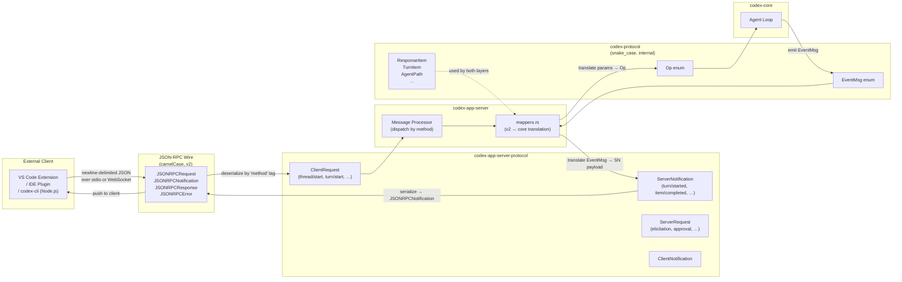
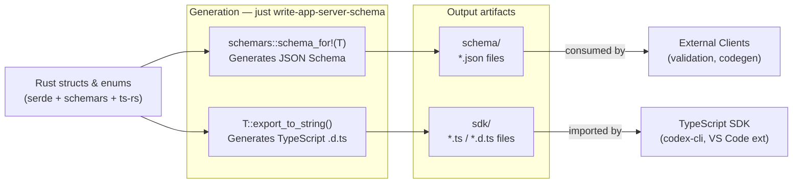

# API & Protocol Layer

> **Last updated:** referencing [`github.com/openai/codex`](https://github.com/openai/codex) `main` branch.

> Two protocol crates form the backbone of all Codex communication: `codex-protocol` (pure internal data types) and `codex-app-server-protocol` (JSON-RPC wire types for external clients). Neither crate depends on the other's runtime siblings — they are pure data crates that can be freely shared across the call stack.

---

## 1. Overview

The protocol layer solves two separate problems:

1. **Internal messaging** (`codex-protocol`): How does the agent loop communicate with the rest of `codex-core`? The answer is the `Op`/`EventMsg` message types, plus all supporting structs (`ResponseItem`, `TurnItem`, `AgentPath`, `SandboxPolicy`, etc.). This crate has no dependency on `codex-core`, making it safe to import from the app server, TUI, or any external tool without creating circular dependencies.

2. **External wire protocol** (`codex-app-server-protocol`): How do external clients (VS Code, IDE plugins, the Node.js CLI wrapper) communicate with `codex-app-server`? The answer is a JSON-RPC 2.0 message framing layer with strongly typed `ClientRequest`, `ServerNotification`, and `ServerRequest` enums. This crate generates both JSON Schema and TypeScript types from the same Rust source.

---

## 2. Layered Protocol Mapping



> **Note:** The `mappers.rs` file in `codex-app-server-protocol` performs the translation between the camelCase v2 wire types and the snake_case internal core types. This is the only place where the two naming worlds meet.

---

## 3. JSON-RPC Wire Protocol

Codex uses JSON-RPC 2.0 message framing. Messages are newline-delimited JSON objects sent over stdio or WebSocket frames.

> **Note:** Codex does not send or validate the `"jsonrpc": "2.0"` field. The implementation in `jsonrpc_lite.rs` explicitly documents this deviation.

### Message Types

| Rust Type | Direction | Has `id`? | Description |
|---|---|---|---|
| `JSONRPCRequest` | Client → Server | Yes | A call that expects a `JSONRPCResponse` |
| `JSONRPCNotification` | Client → Server | No | One-way notification (no response expected) |
| `JSONRPCResponse` | Server → Client | Yes (matches request) | Success result for a request |
| `JSONRPCError` | Server → Client | Yes (matches request) | Error result for a request |
| `JSONRPCNotification` | Server → Client | No | Server-push event (e.g. `turn/started`) |

`RequestId` is either a `String` or `i64`, matching the JSON-RPC spec for request correlation.

### Request Format

```json
{
  "id": "req-001",
  "method": "turn/start",
  "params": {
    "threadId": "thd_abc123",
    "userInput": [{ "type": "text", "text": "Refactor this function" }]
  },
  "trace": {
    "traceparent": "00-abc...",
    "tracestate": ""
  }
}
```

### Response Format

```json
{
  "id": "req-001",
  "result": {
    "turnId": "turn_xyz789"
  }
}
```

### Error Format

```json
{
  "id": "req-001",
  "error": {
    "code": -32600,
    "message": "Invalid params: threadId is required",
    "data": { "field": "threadId" }
  }
}
```

### Method Naming Convention

All method names use `<resource>/<verb>` or `<resource>/<subresource>/<verb>` with camelCase segments:

```
thread/start
thread/read
thread/name/set
turn/start
turn/steer
turn/interrupt
account/read
account/login/start
account/rateLimits/read
config/read
config/value/write
```

> **Note:** Resources are always singular (`thread`, `turn`, `account`), not plural. Sub-resources use additional `/` segments, not dot notation.

---

## 4. v1 vs v2 API

| Dimension | v1 | v2 |
|---|---|---|
| **Status** | Legacy / maintenance only | Active — all new development here |
| **Field naming** | Mix of `camelCase` and `snake_case` | Strictly `camelCase` (`#[serde(rename_all = "camelCase")]`) |
| **TypeScript export** | `ts-rs` exports to root dir | `ts-rs` exports to `v2/` subdirectory |
| **Wire method names** | e.g. `getConversationSummary`, `getAuthStatus`, `gitDiffToRemote` | e.g. `thread/start`, `turn/start`, `account/read` |
| **Event serialization** | `task_started`, `task_complete` (in `EventMsg`) | `turn/started`, `turn/completed` (in `ServerNotification`) |
| **Enum mirroring** | Direct re-export of core enums | `v2_enum_from_core!` macro generates camelCase mirrors with `From` impls |
| **Schema generation** | Included in allowlist (`InitializeParams`, `InitializeResponse`) | Full schema generation via `just write-app-server-schema` |
| **Experimental gating** | Not supported | `#[experimental("reason")]` attribute + `ExperimentalApi` trait |

> **Note:** The `#[serde(rename = "task_started", alias = "turn_started")]` annotation on `EventMsg::TurnStarted` maintains backward compatibility — the v1 wire name is still accepted for deserialization but the canonical v2 name is `turn_started`.

v1 client request methods still supported (enumerated in `V1_CLIENT_REQUEST_METHODS`):
- `getConversationSummary`
- `gitDiffToRemote`
- `getAuthStatus`

---

## 5. Client → Server Messages (`ClientRequest`)

`ClientRequest` is a Rust enum where each variant corresponds to one JSON-RPC method. The macro `client_request_definitions!` generates the enum, a `method()` accessor, and response type exports.

### Thread Management

| Method | Variant | Params Type | Response Type |
|---|---|---|---|
| `thread/start` | `ThreadStart` | `ThreadStartParams` | `ThreadStartResponse` |
| `thread/resume` | `ThreadResume` | `ThreadResumeParams` | `ThreadResumeResponse` |
| `thread/fork` | `ThreadFork` | `ThreadForkParams` | `ThreadForkResponse` |
| `thread/read` | `ThreadRead` | `ThreadReadParams` | `ThreadReadResponse` |
| `thread/list` | `ThreadList` | `ThreadListParams` | `ThreadListResponse` |
| `thread/loaded/list` | `ThreadLoadedList` | `ThreadLoadedListParams` | `ThreadLoadedListResponse` |
| `thread/archive` | `ThreadArchive` | `ThreadArchiveParams` | `ThreadArchiveResponse` |
| `thread/unarchive` | `ThreadUnarchive` | `ThreadUnarchiveParams` | `()` |
| `thread/unsubscribe` | `ThreadUnsubscribe` | `ThreadUnsubscribeParams` | `()` |
| `thread/name/set` | `ThreadSetName` | `ThreadSetNameParams` | `()` |
| `thread/rollback` | `ThreadRollback` | `ThreadRollbackParams` | `()` |
| `thread/compact/start` | `ThreadCompactStart` | `ThreadCompactStartParams` | `()` |
| `thread/shellCommand` | `ThreadShellCommand` | `ThreadShellCommandParams` | `ThreadShellCommandResponse` |

### Turn Lifecycle

| Method | Variant | Params Type | Response Type |
|---|---|---|---|
| `turn/start` | `TurnStart` | `TurnStartParams` | `TurnStartResponse` |
| `turn/steer` | `TurnSteer` | `TurnSteerParams` | `TurnSteerResponse` |
| `turn/interrupt` | `TurnInterrupt` | `TurnInterruptParams` | `()` |

### Account & Auth

| Method | Variant | Params Type | Response Type |
|---|---|---|---|
| `account/read` | `GetAccount` | `GetAccountParams` | `GetAccountResponse` |
| `account/login/start` | `LoginAccount` | `LoginAccountParams` | `LoginAccountResponse` |
| `account/login/cancel` | `CancelLoginAccount` | `CancelLoginAccountParams` | `()` |
| `account/logout` | `LogoutAccount` | `LogoutAccountParams` | `()` |
| `account/rateLimits/read` | `GetAccountRateLimits` | `GetAccountRateLimitsParams` | `GetAccountRateLimitsResponse` |

### Configuration

| Method | Variant | Params Type | Response Type |
|---|---|---|---|
| `config/read` | `ConfigRead` | `ConfigReadParams` | `ConfigReadResponse` |
| `config/value/write` | `ConfigValueWrite` | `ConfigValueWriteParams` | `ConfigWriteResponse` |
| `config/batchWrite` | `ConfigBatchWrite` | `ConfigBatchWriteParams` | `ConfigWriteResponse` |
| `configRequirements/read` | `ConfigRequirementsRead` | `ConfigRequirementsReadParams` | `ConfigRequirementsReadResponse` |
| `config/mcpServer/reload` | `McpServerRefresh` | `McpServerRefreshParams` | `()` |

### Apps

| Method | Variant | Params Type | Response Type |
|---|---|---|---|
| `app/list` | `AppsList` | `AppsListParams` | `AppsListResponse` |

---

## 6. Server → Client Messages (`ServerNotification`)

The server pushes notifications to clients without a matching request. These are serialized as `JSONRPCNotification` objects (no `id` field).

### Turn & Item Lifecycle

| Method | Notification Type | Description |
|---|---|---|
| `turn/started` | `TurnStartedNotification` | A turn has begun processing |
| `turn/completed` | `TurnCompletedNotification` | A turn has finished; includes token usage |
| `item/started` | `ItemStartedNotification` | An item (message, tool call, patch) has begun |
| `item/completed` | `ItemCompletedNotification` | An item has finished |
| `item/agentMessage/delta` | `AgentMessageDeltaNotification` | Streaming text chunk from the agent |
| `item/plan/delta` | `PlanDeltaNotification` | Streaming update to the structured plan |
| `item/reasoning/summaryTextDelta` | `ReasoningSummaryTextDeltaNotification` | Reasoning summary text delta |
| `turn/diff/updated` | `TurnDiffUpdatedNotification` | File diff for the current turn |
| `turn/plan/updated` | `TurnPlanUpdatedNotification` | Structured plan update |

### Command Execution

| Method | Notification Type | Description |
|---|---|---|
| `item/commandExecution/outputDelta` | `CommandExecutionOutputDeltaNotification` | stdout/stderr chunk from a running command |
| `item/commandExecution/terminalInteraction` | `TerminalInteractionNotification` | stdin/stdout pair from an interactive terminal |
| `item/fileChange/outputDelta` | `FileChangeOutputDeltaNotification` | Incremental file change output |

### MCP

| Method | Notification Type | Description |
|---|---|---|
| `item/mcpToolCall/progress` | `McpToolCallProgressNotification` | MCP tool call progress update |
| `mcpServer/startupStatus/updated` | `McpServerStatusUpdatedNotification` | MCP server startup progress |
| `mcpServer/oauthLogin/completed` | `McpServerOauthLoginCompletedNotification` | MCP OAuth login completed |

### Thread & Account

| Method | Notification Type | Description |
|---|---|---|
| `thread/started` | `ThreadStartedNotification` | A thread was created |
| `thread/status/changed` | `ThreadStatusChangedNotification` | Thread status transition |
| `thread/closed` | `ThreadClosedNotification` | Thread has been closed / cleaned up |
| `thread/name/updated` | `ThreadNameUpdatedNotification` | Thread name changed |
| `thread/tokenUsage/updated` | `ThreadTokenUsageUpdatedNotification` | Token usage updated for thread |
| `thread/compacted` | `ContextCompactedNotification` | Context was compacted (deprecated; use item type instead) |
| `account/updated` | `AccountUpdatedNotification` | Account info changed (plan, credits, etc.) |
| `account/rateLimits/updated` | `AccountRateLimitsUpdatedNotification` | Rate limit counters updated |
| `app/list/updated` | `AppListUpdatedNotification` | Available apps list changed |

### System

| Method | Notification Type | Description |
|---|---|---|
| `error` | `ErrorNotification` | Server-side error not tied to a request |
| `model/rerouted` | `ModelReroutedNotification` | Model was automatically rerouted |
| `deprecationNotice` | `DeprecationNoticeNotification` | Feature deprecation warning |
| `configWarning` | `ConfigWarningNotification` | Non-fatal configuration issue |
| `skills/changed` | `SkillsChangedNotification` | Skills files changed on disk |
| `fs/changed` | `FsChangedNotification` | Watched file system paths changed |

---

## 7. Type Naming Conventions

### Naming Rules

| Concern | Convention | Example |
|---|---|---|
| Request params | `*Params` | `TurnStartParams`, `ThreadReadParams` |
| Request responses | `*Response` | `TurnStartResponse`, `GetAccountResponse` |
| Server-push payloads | `*Notification` | `TurnStartedNotification`, `AgentMessageDeltaNotification` |
| Wire field names (v2) | `camelCase` | `threadId`, `turnId`, `userInput` |
| Internal field names | `snake_case` | `thread_id`, `turn_id`, `user_input` |
| v2 enum mirrors | PascalCase variant, `camelCase` serialization | `AskForApproval::UnlessTrusted` → `"unlessTrusted"` |

### camelCase Enforcement

All v2 types use `#[serde(rename_all = "camelCase")]` at the struct or enum level. The macro `v2_enum_from_core!` generates v2 camelCase mirrors of internal enums and implements `From<CoreEnum> for V2Enum` automatically.

```rust
// Example from v2.rs
#[derive(Serialize, Deserialize, Debug, Clone, Copy, PartialEq, Eq, JsonSchema, TS)]
#[serde(rename_all = "camelCase")]
#[ts(export_to = "v2/")]
pub enum AskForApproval {
    UnlessTrusted,
    OnFailure,
    OnRequest,
    Never,
    // ...
}
```

### Experimental Gating

Methods or fields that are not yet stable are marked with `#[experimental("reason-identifier")]`. The `ExperimentalApi` derive macro (from `codex-experimental-api-macros`) causes the app server to reject requests using experimental methods unless the client has declared `"experimentalApi": true` in its `InitializeCapabilities`.

```rust
#[experimental("thread/realtime/start")]
ThreadRealtimeStart => "thread/realtime/start" {
    params: ThreadRealtimeStartParams,
    response: ThreadRealtimeStartResponse,
}
```

Experimental fields on otherwise-stable types use `inventory::collect!(ExperimentalField)` to register at startup, allowing field-level gating without making the whole method experimental.

---

## 8. Schema Generation

The Rust type system is the single source of truth for both JSON Schema and TypeScript definitions. The pipeline is:



The generation entry point is in `codex-app-server-protocol/src/export.rs`:

- `generate_ts(out_dir, prettier)` — writes TypeScript definitions (calls `ts-rs`)
- `generate_json(out_dir)` — writes JSON Schema files (calls `schemars`)
- `generate_types(out_dir, prettier)` — runs both

The justfile task `just write-app-server-schema` invokes a binary that calls these functions and writes output to the `sdk/` directory.

Special handling:
- `SPECIAL_DEFINITIONS` (`ClientRequest`, `ServerNotification`, etc.) are "flattened" — all variants are inlined into a single discriminated union in TypeScript.
- `EXCLUDED_SERVER_NOTIFICATION_METHODS_FOR_JSON` lists methods that are omitted from JSON Schema output (e.g. `rawResponseItem/completed`, which is internal-only).
- v1 types are placed in a separate `v1/` subdirectory to avoid polluting v2 consumers.

---

## 9. Key Files

| File | Crate | Purpose |
|---|---|---|
| `protocol/src/protocol.rs` | `codex-protocol` | `Op`, `EventMsg`, `Submission`, `Event`, `SandboxPolicy` — the core internal protocol |
| `protocol/src/agent_path.rs` | `codex-protocol` | `AgentPath` — hierarchical agent addressing |
| `protocol/src/items.rs` | `codex-protocol` | `TurnItem`, `PlanItem` — renderable content types |
| `protocol/src/models.rs` | `codex-protocol` | `ResponseItem`, `ResponseInputItem`, `ContentItem` |
| `app-server-protocol/src/jsonrpc_lite.rs` | `codex-app-server-protocol` | `JSONRPCMessage`, `JSONRPCRequest`, `JSONRPCResponse`, `JSONRPCError`, `RequestId` |
| `app-server-protocol/src/protocol/common.rs` | `codex-app-server-protocol` | `ClientRequest` enum (all methods via macro), `ServerNotification` enum, `AuthMode` |
| `app-server-protocol/src/protocol/v2.rs` | `codex-app-server-protocol` | All v2 params/response/notification structs; `v2_enum_from_core!` mirrors |
| `app-server-protocol/src/protocol/v1.rs` | `codex-app-server-protocol` | Legacy v1 types (`InitializeParams`, `GetConversationSummaryResponse`, etc.) |
| `app-server-protocol/src/protocol/mappers.rs` | `codex-app-server-protocol` | Translation between v2 wire types and core internal types |
| `app-server-protocol/src/experimental_api.rs` | `codex-app-server-protocol` | `ExperimentalApi` trait; `ExperimentalField` inventory |
| `app-server-protocol/src/export.rs` | `codex-app-server-protocol` | `generate_ts()`, `generate_json()`, `generate_types()` — schema generation |
| `codex-experimental-api-macros/src/lib.rs` | `codex-experimental-api-macros` | `#[derive(ExperimentalApi)]` and `#[experimental("…")]` proc macros |

---

## 10. Integration Points

| Topic | See |
|---|---|
| How `ClientRequest` maps to `Op` submissions in the agent loop | [01-core-engine.md](./01-core-engine.md) |
| How the app server handles stdio and WebSocket transports | 03-app-server.md |
| Auth modes (`ApiKey`, `Chatgpt`, `ChatgptAuthTokens`) and login flow | 10-auth.md |
| TypeScript SDK generated from these types | 05-cli.md |
| Responses API proxy (backend routing for ChatGPT auth) | 11-responses-api-proxy.md |
