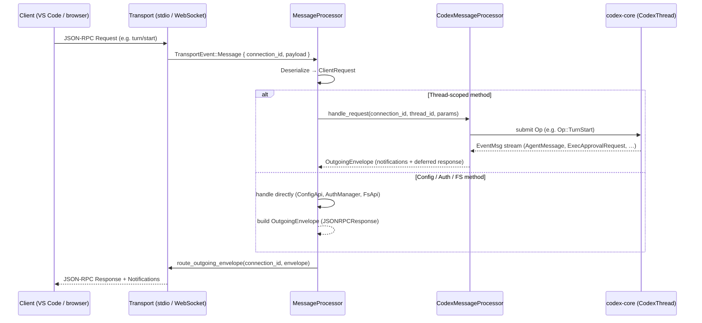

# 03 — App Server & Transport Layer

> **Last updated:** based on [github.com/openai/codex](https://github.com/openai/codex) `main` branch (`codex-rs/app-server/`).  
> **Related docs:** [Core Engine](01-core-engine.md) · [API & Protocol](02-api-protocol.md) · [Security & Sandboxing](04-security-sandboxing.md) · [Exec Policy](05-exec-policy.md)

---

## Overview

`codex-app-server` is the interface layer that powers rich clients such as the [Codex VS Code extension](https://marketplace.visualstudio.com/items?itemName=openai.chatgpt). It exposes a **JSON-RPC 2.0** API on top of a pluggable transport (stdio or WebSocket) and bridges incoming client requests to one or more `codex-core` conversation threads.

The crate is structured around three cooperating layers:

| Layer | Key type | Responsibility |
|---|---|---|
| Transport | `TransportEvent` / `ConnectionState` | I/O framing, connection lifecycle, auth |
| Dispatch | `MessageProcessor` | Per-connection request routing & thread registry |
| Business logic | `CodexMessageProcessor` | Actual JSON-RPC method implementations |

**Companion crates:**

| Crate | Purpose |
|---|---|
| `codex-app-server-protocol` | Shared wire types: `ClientRequest`, `ServerNotification`, `JSONRPCMessage` |
| `codex-app-server-client` | Client connector (in-process or remote WebSocket) |

---

## Transport Modes

The server binary accepts a single `--listen <URL>` flag. Two transports are supported, selected by URL scheme:

| Feature | `stdio://` (default) | `ws://IP:PORT` |
|---|---|---|
| Connection model | Single, long-lived stdin/stdout pipe | Multiple concurrent WebSocket clients |
| Multiplexing | Fixed single `ConnectionId` | One `ConnectionId` per accepted socket upgrade |
| Auth | N/A (process isolation is the boundary) | Optional: capability-token or signed JWT bearer token |
| Origin guard | N/A | Requests bearing an `Origin` header are rejected `403` |
| Loopback note | Always local | Binds `localhost` only by default; use SSH port-forwarding for remote |
| Health endpoints | None | `/healthz` and `/readyz` on the same TCP port |
| Primary use case | VS Code extension (in-process), TUI | Remote GUIs, web clients, CI integrations |
| Implementation | `transport/stdio.rs` | `transport/websocket.rs` |

### Stdio transport

`start_stdio_connection()` spawns two tasks:
1. A **reader** that deserializes newline-delimited JSON frames from `stdin` and emits `TransportEvent::Message` events.
2. A **writer** that serializes outgoing `QueuedOutgoingMessage` frames to `stdout`.

### WebSocket transport

`start_websocket_acceptor()` builds an `axum` router with:
- Health-check handlers at `GET /healthz` and `GET /readyz`.
- An `any /` handler that upgrades HTTP connections via `WebSocketUpgrade`.
- A middleware layer (`reject_requests_with_origin_header`) that rejects any request carrying an `Origin` header — preventing browser cross-site attacks.
- An `Arc<AtomicU64>` connection counter that assigns monotonically increasing `ConnectionId` values.

#### Auth bridge

When started with `--ws-auth capability-token`, the server reads a token file on disk and validates each WebSocket upgrade request against a constant-time HMAC comparison. With `--ws-auth signed-bearer-token`, it validates a JWT (HS256), checking `iss`, `aud`, and clock-skew bounds (default ±30 s, configurable via `--ws-max-clock-skew-seconds`).

```
--ws-auth capability-token  →  Authorization: Bearer <static-token>
--ws-auth signed-bearer-token  →  Authorization: Bearer <JWT signed with shared secret>
```

---

## MessageProcessor

`MessageProcessor` (`src/message_processor.rs`) is the central dispatcher. One shared instance handles all active connections. It owns:

- A **thread registry**: `BTreeMap<ThreadId, Arc<CodexThread>>` of all in-memory conversations.
- A **connection registry**: `HashMap<ConnectionId, ConnectionSessionState>` for per-connection state.
- A **config snapshot** and feature-flag state shared across connections.

On receiving a `TransportEvent::Message`, the processor:

1. Deserializes the raw JSON into a `ClientRequest` or `ClientNotification`.
2. Looks up (or initializes) the `ConnectionSessionState` for the originating `ConnectionId`.
3. Dispatches to `CodexMessageProcessor::handle_request()` for thread-scoped methods, or handles directly for config/auth/FS methods.
4. Serializes the result into an `OutgoingEnvelope` and routes it through `OutgoingMessageSender`.

---

## Message Routing Flow



---

## Thread Management

Each conversation is represented by a `CodexThread` (owned by `codex-core`). The app-server maintains a `ThreadState` per loaded thread:

| Field | Purpose |
|---|---|
| `listener_generation: u64` | Monotonic counter; detects stale listeners after re-subscribe |
| `cancel_tx: oneshot::Sender<()>` | Cancels the active turn listener |
| `listener_thread: Weak<CodexThread>` | Detects if a new thread object replaced an old one |
| `pending_interrupts` | Queue of in-flight interrupt requests |
| `current_turn_history` | `ThreadHistoryBuilder` accumulating items during an active turn |

### Thread lifecycle JSON-RPC methods

| Method | Effect |
|---|---|
| `thread/start` | Creates a new `CodexThread`, registers it, emits `thread/started` |
| `thread/resume` | Reloads a thread from disk rollout; atomically subscribes for new events |
| `thread/fork` | Copies a thread's rollout up to a given turn, creating a new `ThreadId` |
| `thread/archive` | Moves the JSONL rollout file to the archived sessions directory |
| `thread/unarchive` | Moves an archived rollout back to the sessions directory |
| `thread/rollback` | Forks to an earlier message index (original history preserved) |
| `thread/unsubscribe` | Removes connection subscription; unloads thread if no subscribers remain |
| `thread/compact/start` | Triggers manual context compaction; emits `item/*` progress notifications |
| `thread/shellCommand` | Runs an unsandboxed shell command; emits `commandExecution` items |

Threads are persisted as JSONL rollout files under `$CODEX_HOME/sessions/`. Archived threads move to `$CODEX_HOME/sessions/archived/`.

---

## Event Broadcasting

When a `CodexThread` emits an `EventMsg`, the `bespoke_event_handling` module transforms it into one or more `ServerNotification` or `ServerRequest` messages wrapped in an `OutgoingEnvelope`.

`route_outgoing_envelope()` in `transport/mod.rs` delivers each envelope to **all** connections subscribed to that thread — not just the one that started the turn. This fan-out enables multi-client collaboration:

```
EventMsg (from Core)
        │
        ▼
OutgoingEnvelope
        │
        ├──► Connection A  (initiating VS Code window)
        ├──► Connection B  (second editor on same workspace)
        └──► Connection C  (web dashboard / CI observer)
```

The `OutgoingMessageSender` is a `tokio::sync::mpsc` channel with a fixed capacity of `CHANNEL_CAPACITY = 128`. Slow consumers experience back-pressure; the server logs a warning if a channel is full but does not block the core engine.

---

## Approval Flow

When the core engine needs user approval (e.g., before running a shell command or applying a patch), it emits an approval-request event. `CodexMessageProcessor` converts this into a **`ServerRequest`** — a JSON-RPC request *from server to client*. The client must respond before the turn can continue.

Approval types:

| Server → Client request | Client → Server response |
|---|---|
| `commandExecution/requestApproval` | `CommandExecutionRequestApprovalResponse` |
| `fileChange/requestApproval` | `FileChangeRequestApprovalResponse` |
| `exec/commandApproval` | `ExecCommandApprovalResponse` |
| `permissions/requestApproval` | `PermissionsRequestApprovalResponse` |
| `mcpServer/elicitationRequest` | `McpServerElicitationRequestResponse` |

---

## External Auth Bridge

`ExternalAuthRefreshBridge` implements the `ExternalAuth` trait for ChatGPT-mode authentication where the *client* holds live OAuth tokens.

When Codex core needs a fresh token (e.g., after a 401 from the API), the bridge converts the request into a `ServerRequest` sent to the connected client, then awaits the response:

```
Codex Core → ExternalAuth::refresh(reason)
    → ExternalAuthRefreshBridge::refresh()
        → OutgoingMessageSender::send_request(ChatgptAuthTokensRefresh)
            → [JSON-RPC server→client request]
                ← Client responds with new tokens
    ← Bridge returns ExternalAuthTokens to Core
```

A 10-second timeout guards against hung clients; if it fires, the pending request is cancelled via `cancel_request()`.

---

## Key Source Files

| File | Description |
|---|---|
| `codex-rs/app-server/src/lib.rs` | `run_main_with_transport()`, tracing setup, config/auth init |
| `codex-rs/app-server/src/message_processor.rs` | `MessageProcessor`: top-level router, connection registry |
| `codex-rs/app-server/src/codex_message_processor.rs` | `CodexMessageProcessor`: thread-scoped Op dispatch |
| `codex-rs/app-server/src/outgoing_message.rs` | `OutgoingMessageSender`: per-connection queuing, fan-out |
| `codex-rs/app-server/src/transport/mod.rs` | `AppServerTransport` enum, `TransportEvent`, `CHANNEL_CAPACITY` |
| `codex-rs/app-server/src/transport/stdio.rs` | Stdio transport implementation |
| `codex-rs/app-server/src/transport/websocket.rs` | WebSocket transport, connection acceptor, startup banner |
| `codex-rs/app-server/src/transport/auth.rs` | WebSocket bearer-token auth (capability-token & signed JWT) |
| `codex-rs/app-server/src/thread_state.rs` | `ThreadState`, `PendingThreadResumeRequest`, `TurnSummary` |
| `codex-rs/app-server/src/thread_status.rs` | `ThreadWatchManager`, thread status resolution |
| `codex-rs/app-server/src/bespoke_event_handling.rs` | `apply_bespoke_event_handling()`: event → notification transform |
| `codex-rs/app-server/src/command_exec.rs` | `CommandExecManager`: interactive terminal command sessions |
| `codex-rs/app-server-protocol/` | Wire types: `ClientRequest`, `ServerNotification`, `JSONRPCMessage` |
| `codex-rs/app-server-client/src/remote.rs` | Remote WebSocket client connector |
