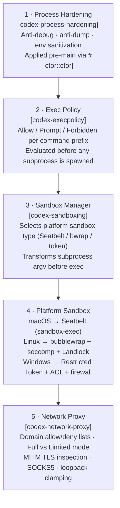
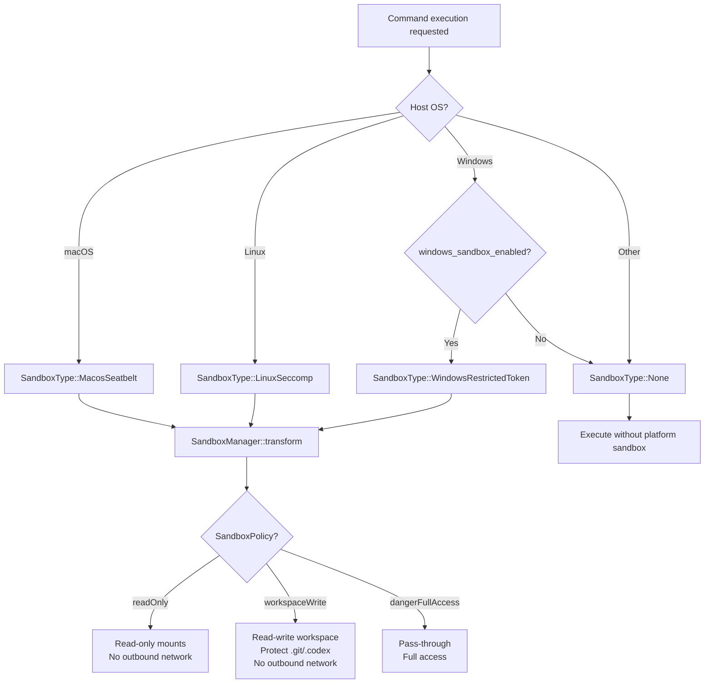
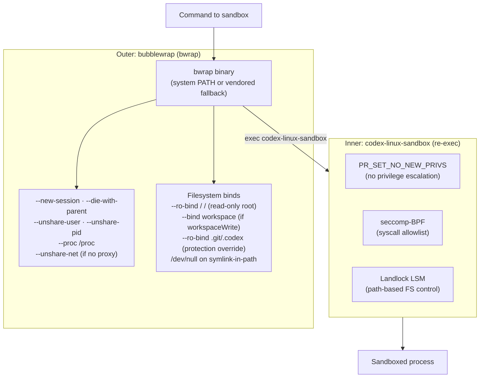

# 04 — Security & Sandboxing

> **Last updated:** based on [github.com/openai/codex](https://github.com/openai/codex) `main` branch (`codex-rs/sandboxing/`, `codex-rs/linux-sandbox/`, `codex-rs/windows-sandbox-rs/`, `codex-rs/network-proxy/`, `codex-rs/process-hardening/`).  
> **Related docs:** [Core Engine](01-core-engine.md) · [App Server](03-app-server.md) · [Exec Policy](05-exec-policy.md)

---

## Overview

Codex applies defense-in-depth security across multiple independent layers. The design principle is that the agent's ability to cause harm must be bounded even when the model produces adversarial output. The most restrictive posture is the default; capabilities are selectively re-granted via the configured `SandboxPolicy`.

---

## Defense-in-Depth Layers



No single layer is relied upon exclusively — a bypass of any one layer is contained by the remaining layers.

---

## Layer 1: Process Hardening

`codex-process-hardening` (`src/lib.rs`) exports a single function `pre_main_hardening()`, invoked automatically via `#[ctor::ctor]` before `main()` is reached.

### Per-Platform Measures

| Measure | Linux / Android / FreeBSD | macOS | Windows |
|---|---|---|---|
| Disable core dumps | `setrlimit(RLIMIT_CORE, 0)` | `setrlimit(RLIMIT_CORE, 0)` | Planned |
| Prevent debugger attach | `prctl(PR_SET_DUMPABLE, 0)` | `ptrace(PT_DENY_ATTACH, 0, …)` | Planned |
| Remove loader env vars | Strips all `LD_*` variables | Strips all `DYLD_*` variables | N/A |
| Exit on hardening failure | Exit code 5 (prctl) | Exit code 6 (ptrace) | — |

`LD_PRELOAD` / `DYLD_INSERT_LIBRARIES` removal prevents a compromised environment from injecting shared libraries into the Codex process. Official Linux releases are MUSL-statically linked (making `LD_*` a no-op in practice), but the stripping is retained for dynamically linked builds.

---

## Layer 2: Named Sandbox Policies

`SandboxPolicy` (in `codex-protocol`) governs filesystem and network permissions for sandboxed commands. Three named policies are available at runtime:

| Policy name | Filesystem | Network |
|---|---|---|
| **`readOnly`** | Workspace read-only; system paths readable | No outbound (proxy loopback only) |
| **`workspaceWrite`** | Workspace read-write; system paths readable; `.git`, `.codex` read-only | No outbound (proxy loopback only) |
| **`dangerFullAccess`** | Unrestricted | Unrestricted |

At the API level a `sandboxPolicy` object is passed on `turn/start`:

```json
{
  "type": "workspaceWrite",
  "writableRoots": ["/Users/me/project"],
  "networkAccess": true
}
```

`EffectiveSandboxPermissions` (in `sandboxing/src/policy_transforms.rs`) merges the base `SandboxPolicy` with any additional per-turn `PermissionProfile` grants (e.g., from MCP tool calls). The merged result drives the actual platform sandbox arguments.

---

## Layer 3: Platform Sandbox Selection



`get_platform_sandbox()` in `sandboxing/src/manager.rs` returns the correct `SandboxType` for the current compile target. On Windows, the type depends on the runtime `windows_sandbox_enabled` config flag.

---

## Layer 4a: macOS Seatbelt

macOS uses Apple's `sandbox-exec` kernel facility. The executable path is **hardcoded** to `/usr/bin/sandbox-exec` — never resolved from `PATH` — to prevent PATH-injection attacks.

### Profile Generation

Three template fragments are compiled into the binary and assembled at runtime in `seatbelt.rs`:

| Fragment | Purpose |
|---|---|
| `seatbelt_base_policy.sbpl` | Core Seatbelt rules: `(deny default)` opener, process, signal, file, sysctl |
| `seatbelt_network_policy.sbpl` | Network rules, parameterized with loopback proxy ports |
| `restricted_read_only_platform_defaults.sbpl` | Additional macOS-specific read-only paths |

Dynamic additions at profile assembly time:

- **Workspace paths** — `allow file-read*` or `allow file-write*` rules for each configured writable root.
- **`.git` / `.codex` protection** — writable-root subdirectories `.git` (or resolved `gitdir:` pointer), and `.codex` are re-applied as read-only even under a `workspaceWrite` policy.
- **Loopback proxy ports** — `proxy_loopback_ports_from_env()` extracts ports from `HTTPS_PROXY`, `HTTP_PROXY`, `ALL_PROXY` env vars; only connections to those ports on `localhost` / `127.0.0.1` / `::1` are allowed.
- **Temp directory** — resolved via `confstr(_CS_DARWIN_USER_TEMP_DIR, …)` and added to the allow list.

### Base Profile Structure

The base policy starts with:

```
(version 1)
(deny default)                     ; closed by default
(allow process-exec)               ; child processes inherit the policy
(allow process-fork)
(allow signal (target same-sandbox))
(allow file-write-data (path "/dev/null") (vnode-type CHARACTER-DEVICE))
```

Plus a curated set of `sysctl-read` allows (hardware detection), `mach-*` allows (IPC for system services), and legacy `user-preference-read` for cfprefs-backed macOS behavior.

---

## Layer 4b: Linux Sandboxing

Linux uses a two-stage sandbox with bubblewrap (outer) and `codex-linux-sandbox` (inner).



### bubblewrap (bwrap) Resolution

The sandbox helper resolves `bwrap` with the following priority:

1. **System `bwrap` on `PATH`** (excluding CWD) — preferred.
2. **System `bwrap` without `--argv0` support** — if the system bwrap is too old to support `--argv0`, a no-`--argv0` compatibility path is used for inner re-exec.
3. **Vendored bwrap** (compiled into the binary, `vendored_bwrap.rs`) — used if no system bwrap is found; a startup warning is surfaced through the normal notification path.

### Key bubblewrap Flags

| Flag | Effect |
|---|---|
| `--ro-bind / /` | Entire filesystem read-only by default |
| `--bind <root> <root>` | Adds writable overlay for each configured workspace root |
| `--ro-bind .git .git` | Re-applies `.git` (and resolved `gitdir:`) as read-only inside a writable root |
| `--unshare-user` | New user namespace — maps UID/GID |
| `--unshare-pid` | New PID namespace — process cannot see host PIDs |
| `--unshare-net` | New network namespace — no outbound network (not set when proxy routing is active) |
| `--proc /proc` | Mounts a fresh `/proc` (skippable with `--no-proc` in restrictive container envs) |
| `--new-session` | Creates new session, detaches from controlling terminal |
| `--die-with-parent` | Sandbox exits when parent exits (no orphans) |

### Managed Proxy Mode (Linux)

When a network proxy is configured, `--unshare-net` is still applied but the sandbox receives an internal TCP→UDS→TCP routing bridge so tool traffic reaches only configured proxy endpoints. After the bridge is live, seccomp additionally blocks new `AF_UNIX`/socketpair creation for the user command.

### Kernel Capability Requirements

bubblewrap uses unprivileged user namespaces (`CLONE_NEWUSER`). This requires:
- Linux kernel ≥ 3.8 for `CLONE_NEWUSER`.
- `kernel.unprivileged_userns_clone = 1` (on distros that gate this, e.g., Debian/Ubuntu with AppArmor).
- `CAP_SYS_ADMIN` is **not** required — bwrap is designed to be setuid-free.

### Landlock Fallback

The **legacy Landlock path** is used instead of bubblewrap when `features.use_legacy_landlock = true` (or CLI flag `-c use_legacy_landlock=true`). The fallback is also automatically selected when the split filesystem policy is equivalent to the legacy `SandboxPolicy` model after CWD resolution. Policies requiring direct read-restriction, denied carveouts, or reopened writable descendants under read-only parents always route through bubblewrap.

Landlock rules are constructed from `FileSystemSandboxPolicy` entries in `sandboxing/src/landlock.rs`, providing a second independent filesystem restriction layer within the inner process.

---

## Layer 4c: Windows Sandboxing

Windows uses restricted access tokens and ACL manipulation (process namespacing is unavailable).

### Token Architecture

Two token modes, selected by `WindowsSandboxLevel`:

| Token mode | Integrity level | Use case |
|---|---|---|
| **Unelevated restricted token** | Low | Default; `create_readonly_token_with_cap()` or workspace-write variant |
| **Elevated setup/runner backend** | Medium (setup) + Low (runner) | Full split-filesystem policy enforcement; elevated helper negotiates ACLs then launches restricted runner |

Capability SIDs are custom security identifiers embedded in the process token. ACLs on sandboxed resources are set to accept only those SIDs; any resource without a matching ACE denies access.

### Additional Windows Mitigations

| Mitigation | Description |
|---|---|
| **Private desktop** | `windows_sandbox_private_desktop = true` creates an isolated desktop object, preventing keylogging and screen capture |
| **System path whitelist** | When `include_platform_defaults = true`, the elevated backend adds `C:\Windows`, `C:\Program Files`, `C:\Program Files (x86)`, `C:\ProgramData` as readable roots |
| **User ACL hiding** | `hide_users.rs` manipulates ACLs to hide other sandbox user accounts |
| **Firewall rules** | `firewall.rs` enforces Windows Firewall rules on the sandboxed process |
| **DPAPI** | `dpapi.rs` ties key material to the user's Windows login session |

---

## Layer 5: Network Proxy

`codex-network-proxy` runs a local HTTP proxy (default `127.0.0.1:3128`) and optionally a SOCKS5 proxy (default `127.0.0.1:8081`). All sandboxed processes are forced to route through it via injected `HTTP_PROXY` / `HTTPS_PROXY` / `ALL_PROXY` env vars.

### Domain Allow/Deny Lists

```toml
[permissions.workspace.network.domains]
"*.openai.com"  = "allow"   # scoped wildcard: subdomains only
"**.openai.com" = "allow"   # apex + subdomains
"localhost"     = "allow"
"evil.example"  = "deny"    # deny always wins over allow
```

- **Allowlist-first**: if no domain entry is marked `allow`, all requests are blocked until an allowlist is configured.
- **Deny wins**: `deny` entries always override any `allow` match.
- **Global `*` wildcard** is rejected (must be explicitly enabled).

### Proxy Modes

| Mode | Behavior |
|---|---|
| `full` | Pass-through; all allowed domains reach the upstream without inspection |
| `limited` | Only `GET`, `HEAD`, `OPTIONS` forwarded; `POST` / `PUT` / `DELETE` blocked; SOCKS5 blocked |

### MITM TLS Inspection

When `mitm = true` (HTTPS + Limited mode), the proxy terminates TLS using a local CA cert managed under `$CODEX_HOME/proxy/` (`ca.pem` + `ca.key`). This allows `limited` mode method-policy enforcement on HTTPS traffic that would otherwise be an opaque CONNECT tunnel. TLS is implemented via rustls (rama-tls-rustls) to avoid BoringSSL/OpenSSL symbol collisions.

### SOCKS5 Support

Both HTTP CONNECT and SOCKS5 tunneling go through the same domain policy checks. SOCKS5 is blocked in `limited` mode.

### Loopback Clamping

- Non-loopback proxy binds are clamped to loopback unless `dangerously_allow_non_loopback_proxy = true`.
- When `allow_local_binding = false` (default), the proxy blocks loopback and private/link-local IP ranges.
- Hostnames that resolve to local/private IPs are blocked even if explicitly allowlisted (best-effort DNS check).

### Unix Socket Proxying (macOS only)

The proxy supports routing to Unix domain sockets via the `x-unix-socket: /path` request header. The allowed socket paths are configured via `[permissions.workspace.network.unix_sockets]`. `dangerously_allow_all_unix_sockets = true` bypasses the allowlist entirely (macOS-only).

### Exec-Policy Network Hook

The proxy exposes a `NetworkPolicyDecider` hook that can override allowlist-only blocks. If an exec policy already approved `curl *` for a session, the decider can auto-allow network requests originating from that command. Explicit `deny` rules always win over the decider.

---

## Platform Comparison

| Feature | macOS | Linux | Windows |
|---|---|---|---|
| Sandbox mechanism | Seatbelt (`sandbox-exec`) | bubblewrap + seccomp + Landlock | Restricted token + ACL |
| Filesystem isolation | Seatbelt profile rules | Bind mounts + Landlock paths | ACE-based access control |
| Network isolation | Seatbelt network rules (loopback only) | `--unshare-net` + proxy bridge | Windows Firewall rules |
| Syscall filtering | Via Seatbelt kernel policy | seccomp-BPF allowlist | N/A (token-based) |
| Privilege escalation | Seatbelt deny rules | `PR_SET_NO_NEW_PRIVS` | Restricted token integrity level |
| `.git` / `.codex` protection | Re-applied read-only in profile | `--ro-bind` override inside writable root | ACL-based |
| Anti-debug | `ptrace(PT_DENY_ATTACH)` | `prctl(PR_SET_DUMPABLE, 0)` | Planned |
| Core dump prevention | `setrlimit(RLIMIT_CORE, 0)` | `setrlimit(RLIMIT_CORE, 0)` | Planned |
| Loader var stripping | `DYLD_*` removed | `LD_*` removed | N/A |
| Private desktop | N/A | N/A | Optional (`private_desktop = true`) |

---

## Key Source Files

| File | Description |
|---|---|
| `codex-rs/process-hardening/src/lib.rs` | `pre_main_hardening()`: anti-debug, anti-dump, env stripping |
| `codex-rs/sandboxing/src/manager.rs` | `SandboxManager`, `SandboxType`, `get_platform_sandbox()` |
| `codex-rs/sandboxing/src/policy_transforms.rs` | `EffectiveSandboxPermissions`, permission profile merging |
| `codex-rs/sandboxing/src/seatbelt.rs` | macOS: profile assembly, loopback port extraction, `.git` protection |
| `codex-rs/sandboxing/src/seatbelt_base_policy.sbpl` | macOS Seatbelt base profile template |
| `codex-rs/sandboxing/src/seatbelt_network_policy.sbpl` | macOS network policy Seatbelt template |
| `codex-rs/sandboxing/src/bwrap.rs` | Linux: bubblewrap argument construction |
| `codex-rs/sandboxing/src/landlock.rs` | Linux: Landlock LSM rule construction |
| `codex-rs/linux-sandbox/src/launcher.rs` | Inner sandbox: `PR_SET_NO_NEW_PRIVS`, seccomp, exec |
| `codex-rs/linux-sandbox/src/bwrap.rs` | bwrap resolution (system → no-argv0 compat → vendored) |
| `codex-rs/linux-sandbox/src/vendored_bwrap.rs` | Vendored bwrap binary extraction |
| `codex-rs/linux-sandbox/src/proxy_routing.rs` | Managed proxy TCP→UDS→TCP bridge |
| `codex-rs/windows-sandbox-rs/src/token.rs` | Restricted token creation |
| `codex-rs/windows-sandbox-rs/src/desktop.rs` | Private desktop creation |
| `codex-rs/windows-sandbox-rs/src/firewall.rs` | Windows Firewall rule enforcement |
| `codex-rs/network-proxy/src/lib.rs` | `NetworkProxy`, `NetworkDecision`, `NetworkPolicyRequest` |
| `codex-rs/network-proxy/src/mitm.rs` | TLS MITM for Limited mode (rustls/rama) |
| `codex-rs/network-proxy/src/socks5.rs` | SOCKS5 proxy handler |
| `codex-rs/network-proxy/src/policy.rs` | Domain rule evaluation, `NetworkPolicyDecider` |
| `codex-rs/network-proxy/src/network_policy.rs` | `NetworkMode`, allow/deny list compilation |
