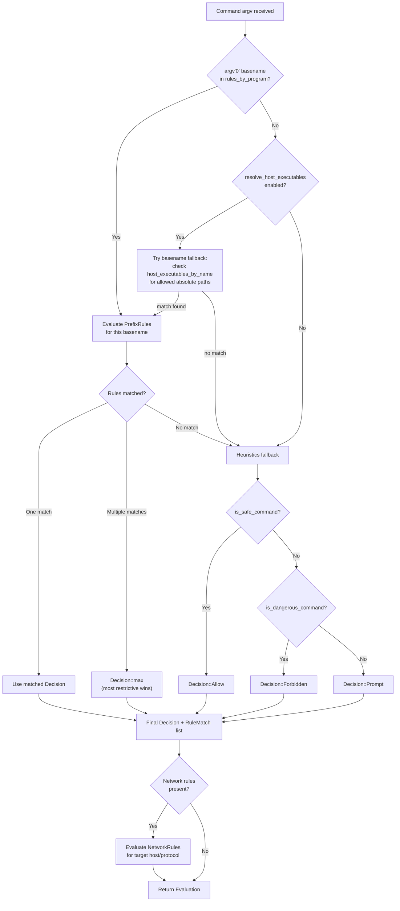
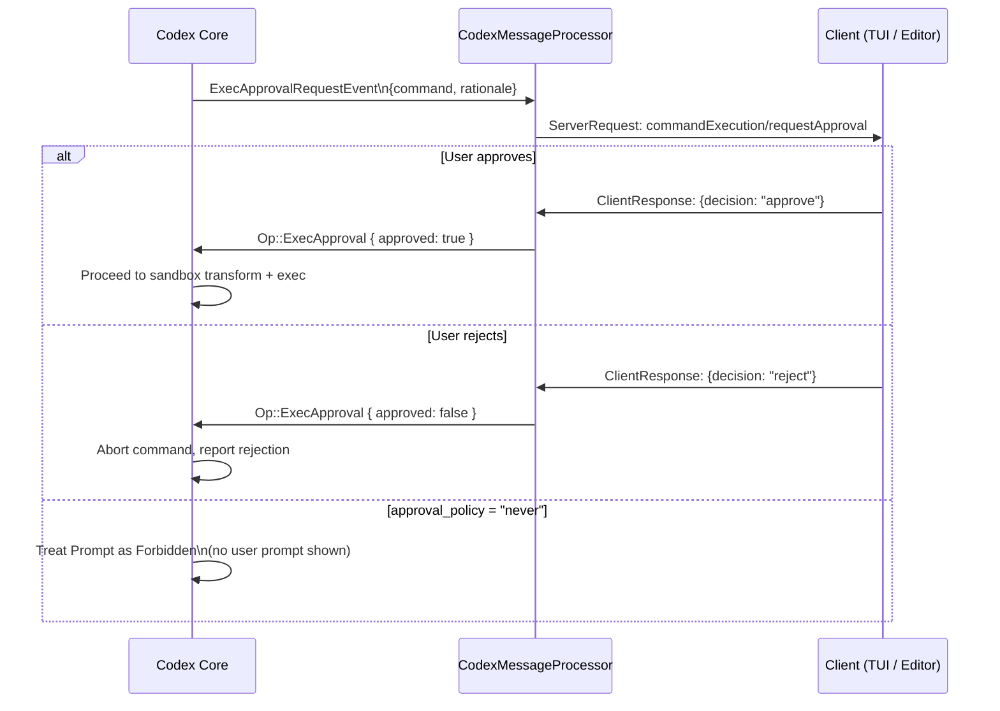

# 05 — Command Execution & Exec Policy

> **Last updated:** based on [github.com/openai/codex](https://github.com/openai/codex) `main` branch (`codex-rs/execpolicy/`, `codex-rs/apply-patch/`, `codex-rs/exec-server/`).  
> **Related docs:** [Core Engine](01-core-engine.md) · [App Server](03-app-server.md) · [Security & Sandboxing](04-security-sandboxing.md)

---

## Overview

Before any subprocess is spawned, a command vector passes through an **exec policy engine** that produces one of three `Decision` values: `Allow`, `Prompt`, or `Forbidden`. Commands that receive `Allow` proceed to [sandbox transformation](04-security-sandboxing.md); commands that receive `Prompt` are held until the user approves or rejects; commands that receive `Forbidden` are rejected immediately.

The exec policy engine lives in `codex-execpolicy`. The **apply-patch** format is Codex's primary file-mutation tool. The **exec-server** crate provides a JSON-RPC interface for remote process and filesystem operations.

---

## Exec Policy Engine

### Core Types

#### `Decision`

```rust
pub enum Decision {
    Allow,    // command may run without approval
    Prompt,   // request explicit user approval
    Forbidden // blocked unconditionally
}
```

`Decision` is `Ord` with `Allow < Prompt < Forbidden`. When multiple rules match, the most restrictive decision wins (`Decision::max`).

#### `Policy`

```rust
pub struct Policy {
    rules_by_program: MultiMap<String, RuleRef>,          // keyed by argv[0] basename
    network_rules:    Vec<NetworkRule>,
    host_executables_by_name: HashMap<String, Arc<[AbsolutePathBuf]>>,
}
```

Key methods:
- `check(argv)` → `Evaluation` — evaluates a command; returns decision + matched rules.
- `get_allowed_prefixes()` → `Vec<Vec<String>>` — returns all explicitly-allowed command prefixes (for display / audit).
- `add_prefix_rule(prefix, decision)` — programmatically appends a rule.

#### `PrefixRule` and `PrefixPattern`

Each rule holds a pattern and a target decision:

```rust
pub struct PrefixPattern {
    first: Arc<str>,           // argv[0] — maps to MultiMap key
    rest:  Arc<[PatternToken]>, // subsequent tokens to match
}

pub enum PatternToken {
    Single(String),       // exact match
    Alts(Vec<String>),    // match any one of the listed alternatives
}
```

`matches_prefix(cmd)` returns `Some(matched_tokens)` if the command starts with the pattern, `None` otherwise. The matched token slice is recorded in the `RuleMatch` for audit and UI display.

#### `RuleMatch`

```rust
pub enum RuleMatch {
    PrefixRuleMatch {
        matched_prefix: Vec<String>,
        decision: Decision,
        resolved_program: Option<AbsolutePathBuf>, // set when basename fallback was used
        justification: Option<String>,             // human-readable rationale from policy file
    },
    HeuristicsRuleMatch {
        command: Vec<String>,
        decision: Decision,
    },
}
```

---

## Policy Decision Flowchart



---

## Policy File Format (Starlark)

Policy files use a Starlark-like syntax:

```python
# Exact prefix: allow git status and git diff
prefix_rule(
    pattern = ["git", ["status", "diff", "log", "show"]],
    decision = "allow",
    justification = "Read-only git commands are safe",
    match     = ["git status", "git log --oneline"],
    not_match = ["git push", "git commit"],
)

# Forbidden with recommended alternative
prefix_rule(
    pattern = ["git", "push"],
    decision = "forbidden",
    justification = "Use `gh pr create` instead of direct push.",
)

# Prompt for anything that requires approval
prefix_rule(
    pattern = ["npm", "publish"],
    decision = "prompt",
)

# Restrict absolute-path bash to known locations only
host_executable(
    name  = "git",
    paths = ["/opt/homebrew/bin/git", "/usr/bin/git"],
)
```

- **`decision`** defaults to `allow` when omitted.
- **`match` / `not_match`** are validated at load time (built-in unit tests).
- **`justification`** is surfaced in approval prompts and rejection messages.
- **`host_executable`** restricts basename fallback to listed absolute paths; if no entry exists, any path is allowed for basename fallback.

---

## Shell Safety Classification

When no prefix rule matches, the engine falls back to heuristics provided by the shell-command safety classifier.

### `is_safe_command(argv)`

Returns `true` for known read-only inspection commands:

| Category | Examples |
|---|---|
| Directory listing | `ls`, `find`, `du`, `tree` |
| File reading | `cat`, `head`, `tail`, `less`, `more`, `wc` |
| Search | `grep`, `rg`, `ag`, `awk`, `sed` (no in-place) |
| Git read-only | `git log`, `git diff`, `git status`, `git show`, `git branch` |
| System info | `echo`, `pwd`, `env`, `which`, `type`, `uname`, `ps`, `top` |

### `is_dangerous_command(argv)`

Returns `true` for patterns associated with irreversible or high-impact actions:

| Category | Examples |
|---|---|
| Destructive file ops | `rm -rf`, `rmdir`, `shred`, `truncate` |
| Disk-level ops | `dd`, `mkfs`, `fdisk`, `parted` |
| Permission changes | `chmod -R`, `chown -R` |
| System control | `shutdown`, `reboot`, `halt`, `systemctl disable` |
| Network exfiltration | `curl … | sh`, `wget … | bash` |
| Code execution | `eval`, `source`, `exec`, `bash -c <untrusted>` |

Commands that match neither allowlist nor denylist return `Decision::Prompt` — they require explicit user approval before running.

---

## Apply Patch System

`codex-apply-patch` implements a custom diff-like format that the agent uses to modify files. It is invoked either as a standalone tool or via the Codex binary's self-invocation path (detected by `arg1 == "--codex-run-as-apply-patch"`).

### Patch Format

The grammar (from `parser.rs`):

```
Patch      := Begin FileOp+ End
Begin      := "*** Begin Patch" NEWLINE
End        := "*** End Patch" NEWLINE?
FileOp     := AddFile | DeleteFile | UpdateFile
AddFile    := "*** Add File: " path NEWLINE ("+" line NEWLINE)+
DeleteFile := "*** Delete File: " path NEWLINE
UpdateFile := "*** Update File: " path NEWLINE MoveTo? Hunk+
MoveTo     := "*** Move to: " newPath NEWLINE
Hunk       := "@@" [ header ] NEWLINE HunkLine* ("*** End of File" NEWLINE)?
HunkLine   := (" " | "-" | "+") text NEWLINE
```

**Markers:**

| Marker | Meaning |
|---|---|
| `*** Begin Patch` | Start of patch envelope |
| `*** End Patch` | End of patch envelope |
| `*** Add File: <path>` | Create a new file; all following `+` lines are its content |
| `*** Update File: <path>` | Modify an existing file in place |
| `*** Delete File: <path>` | Remove an existing file |
| `*** Move to: <path>` | Rename/move a file (placed after `Update File:` header) |
| `@@ [context]` | Hunk context anchor — typically a function or class name |
| `*** End of File` | Marks the final hunk at end-of-file |
| `+` prefix | Added line |
| `-` prefix | Removed line |
| ` ` prefix | Context line (unchanged, used for matching) |

### Example Patch

```
*** Begin Patch
*** Add File: hello.txt
+Hello world
*** Update File: src/app.py
*** Move to: src/main.py
@@ def greet():
-    print("Hi")
+    print("Hello, world!")
*** Delete File: obsolete.txt
*** End Patch
```

### `Hunk` Enum (Internal)

```rust
pub enum Hunk {
    AddFile    { path: PathBuf, contents: String },
    DeleteFile { path: PathBuf },
    UpdateFile {
        path: PathBuf,
        move_path: Option<PathBuf>,
        chunks: Vec<UpdateFileChunk>,
    },
}

pub struct UpdateFileChunk {
    change_context: Option<String>,  // the @@ anchor line
    old_lines: Vec<String>,          // lines to be replaced
    new_lines: Vec<String>,          // replacement lines
    is_end_of_file: bool,            // true when *** End of File marker present
}
```

### Lenient Parser

The parser runs in **lenient mode** (`PARSE_IN_STRICT_MODE = false`) for all models. Originally introduced for `gpt-4.1` compatibility, lenient mode silently strips heredoc wrappers (e.g., `<<'EOF'…EOF`) that some models produce when embedding the patch in a shell command string. Whitespace-padded markers (e.g., `  *** Begin Patch  `) are also accepted.

### Self-Invocation

When the agent needs to apply a patch, it re-invokes its own executable with a special arg:

```
argv[1] == "--codex-run-as-apply-patch"
```

The `codex-arg0` dispatcher detects this at startup and routes execution to the `apply-patch` internal path. This avoids shipping a separate binary while keeping the logic cleanly isolated in `codex-apply-patch`.

---

## Approval Flow

When `Policy::check()` returns `Decision::Prompt`, the execution is held and the client is asked to approve or reject:



The `approval_policy` configuration also gates prompts: when set to `"never"`, any command with `Decision::Prompt` is treated as `Decision::Forbidden` without showing a prompt.

---

## Remote Exec Server

`codex-exec-server` (`codex-rs/exec-server/`) provides a standalone JSON-RPC 2.0 server for remote process management and filesystem operations. It is used when Codex runs against a remote host.

### Lifecycle

```
Client → initialize { clientName }
       ← {} (response)
Client → initialized (notification)
       [connection ready — accepts exec/fs calls]
```

Any notification other than `initialized` before handshake completes is rejected with a JSON-RPC error.

### Process Methods

| Method | Description |
|---|---|
| `command/exec` | Spawn a managed process; returns `processId`, `running`, `exitCode` |
| `command/exec/write` | Write base64-encoded bytes to a running PTY process stdin |
| `command/exec/terminate` | Terminate a running process |

**`command/exec` parameters:** `processId` (caller-chosen), `argv`, `cwd`, `env`, `tty` (PTY vs pipe), `outputBytesCap`, `arg0`.

**Streaming notifications:**

| Notification | When |
|---|---|
| `command/exec/outputDelta` | Output chunk available (`stream`: `stdout` / `stderr`, `chunk`: base64) |
| `command/exec/exited` | Process finished (`exitCode`) |

### Filesystem Methods

| Method | Description |
|---|---|
| `fs/readFile` | Read file contents (base64-encoded) |
| `fs/writeFile` | Write file contents |
| `fs/createDirectory` | Create directory (recursive) |
| `fs/getMetadata` | Stat a path: size, type, permissions, timestamps |
| `fs/readDirectory` | List directory entries |
| `fs/remove` | Remove file or directory |
| `fs/copy` | Copy file or directory |

### Transport

The standalone binary speaks JSON-RPC over WebSocket (`ws://IP:PORT`). One JSON-RPC message per WebSocket text frame. The server terminates all managed processes for a client when its WebSocket connection closes.

### Example Session

```json
{"id":1,"method":"initialize","params":{"clientName":"example"}}
{"id":1,"result":{}}
{"method":"initialized","params":{}}

{"id":2,"method":"command/exec","params":{"processId":"p1","argv":["bash","-c","echo hi"],"cwd":"/repo","env":{},"tty":false}}
{"id":2,"result":{"processId":"p1","running":true,"exitCode":null}}
{"method":"command/exec/outputDelta","params":{"processId":"p1","stream":"stdout","chunk":"aGkK"}}
{"method":"command/exec/exited","params":{"processId":"p1","exitCode":0}}
```

---

## Key Source Files

| File | Description |
|---|---|
| `codex-rs/execpolicy/src/policy.rs` | `Policy`: `rules_by_program`, `check()`, `get_allowed_prefixes()` |
| `codex-rs/execpolicy/src/decision.rs` | `Decision` enum: `Allow`, `Prompt`, `Forbidden` |
| `codex-rs/execpolicy/src/rule.rs` | `PrefixRule`, `PrefixPattern`, `PatternToken`, `NetworkRule`, `RuleMatch` |
| `codex-rs/execpolicy/src/execpolicycheck.rs` | `Evaluation` struct, check orchestration |
| `codex-rs/execpolicy/src/executable_name.rs` | Host executable basename resolution |
| `codex-rs/execpolicy/src/amend.rs` | Append allow-prefix and network rules to existing policy files |
| `codex-rs/execpolicy/src/parser.rs` | Starlark-like policy file parser |
| `codex-rs/execpolicy/examples/example.codexpolicy` | Example policy file |
| `codex-rs/apply-patch/src/parser.rs` | `Hunk` enum, `parse_patch()`, lenient parser logic |
| `codex-rs/apply-patch/src/lib.rs` | `apply_patch()` entry point, `CODEX_CORE_APPLY_PATCH_ARG1` |
| `codex-rs/apply-patch/apply_patch_tool_instructions.md` | Agent-facing patch format reference |
| `codex-rs/exec-server/src/server.rs` | `ExecServer`: JSON-RPC request handling loop |
| `codex-rs/exec-server/src/client.rs` | `ExecServerClient`: WebSocket client connector |
| `codex-rs/exec-server/src/protocol.rs` | Wire types: `InitializeParams`, `CommandExecParams`, etc. |
| `codex-rs/exec-server/src/local_process.rs` | Local PTY/pipe process management |
| `codex-rs/exec-server/src/remote_process.rs` | Remote process proxy |
| `codex-rs/exec-server/src/local_file_system.rs` | Local filesystem operation handlers |
