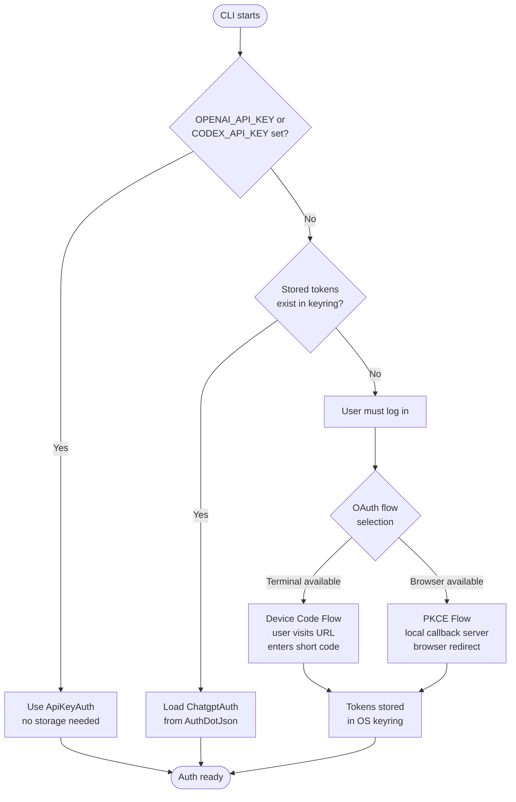
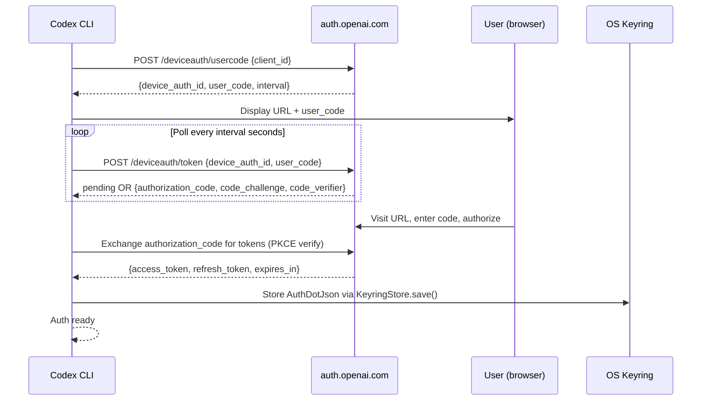
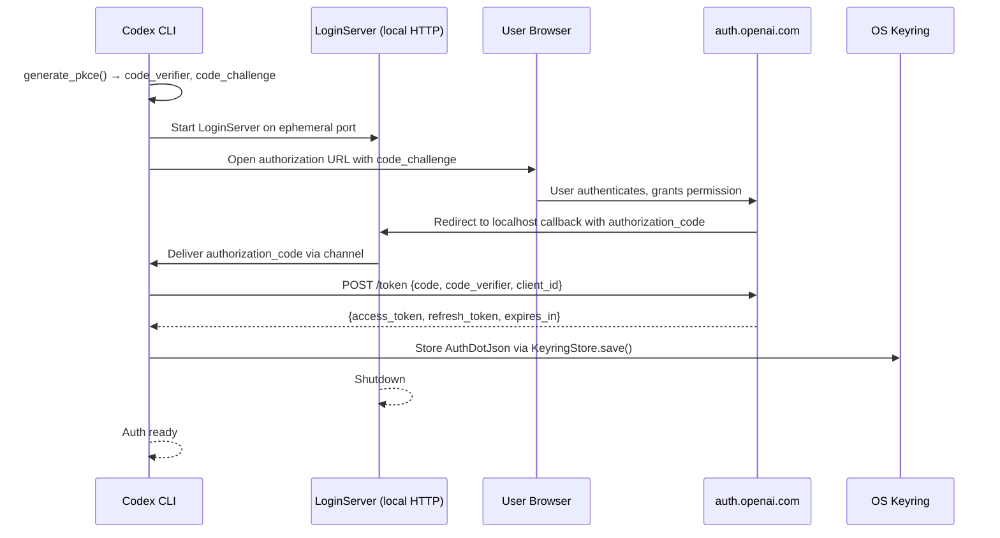
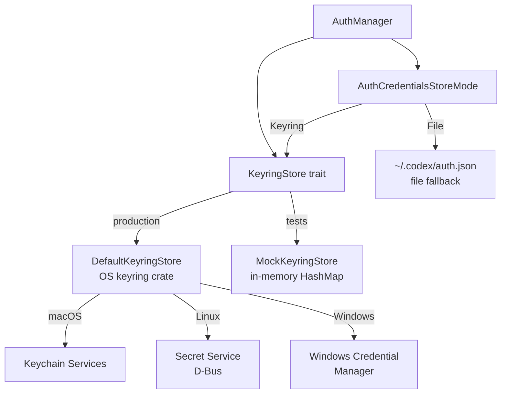

# Authentication & Identity

This document covers how Codex authenticates with OpenAI's APIs, how tokens are acquired
and stored, and how pluggable auth flows integrate with IDE extensions and custom model
providers.

---

## Overview

Codex supports two primary authentication modes:

| Mode | Use Case | Key Type |
|------|----------|----------|
| **API Key** | Direct API access, CI/CD, scripting | Bearer token from env var |
| **ChatGPT OAuth** | Interactive CLI login tied to a ChatGPT account | Short-lived JWT + refresh token |

API key auth is stateless: the key is read from the environment at startup, attached to
every request as a `Bearer` token, and never persisted to disk. ChatGPT OAuth is stateful:
the `AuthManager` acquires tokens via an OAuth flow, stores them in the OS keyring, and
refreshes them automatically before they expire.

---

## Auth Mode Decision Flow



---

## API Key Authentication

When `OPENAI_API_KEY` or `CODEX_API_KEY` is present in the environment, Codex constructs
an `ApiKeyAuth` struct holding the raw key string. No file I/O or token refresh occurs.

```
pub const OPENAI_API_KEY_ENV_VAR: &str = "OPENAI_API_KEY";
pub const CODEX_API_KEY_ENV_VAR:  &str = "CODEX_API_KEY";
```

`CODEX_API_KEY` takes precedence when both are set. The key is attached to every outgoing
HTTP request as `Authorization: Bearer <key>`. It is never written to disk, never logged,
and never included in analytics events.

---

## ChatGPT OAuth — Device Code Flow

The device code flow is designed for terminals without an available browser. The user
visits a short URL and enters a one-time code to authorize the session.



Key types involved:

- `DeviceCode` — holds `verification_url`, `user_code`, `device_auth_id`, and polling `interval`
- `CodeSuccessResp` — carries `authorization_code`, `code_challenge`, and `code_verifier` on successful user authorization

---

## ChatGPT OAuth — PKCE Flow

The PKCE flow uses a local HTTP server to receive the OAuth callback, making it suitable
for environments where a browser can be opened.



`PkceCodes` uses 64 random bytes encoded as URL-safe base64 (no padding) for the verifier.
The challenge is `BASE64URL(SHA256(verifier))` with S256 method.

`LoginServer` (`codex-login/src/server.rs`) binds on an ephemeral port, returns a
`ShutdownHandle`, and closes itself after receiving the callback.

---

## Token Lifecycle

### Refresh Trigger

`AuthManager` evaluates token expiry before each API call. The 8-second threshold means
a token is considered expired when `now >= expires_at - 8s`. This prevents race conditions
where a token expires in transit.

### Refresh Endpoint

Token refresh posts to `https://auth.openai.com/oauth/token`. The URL can be overridden
with `CODEX_REFRESH_TOKEN_URL_OVERRIDE` for testing against staging environments.

### Refresh Token Error Types

| Error Type | Message Key | Recovery |
|------------|-------------|----------|
| Expired | `REFRESH_TOKEN_EXPIRED_MESSAGE` | Log out and sign in again |
| Reused | `REFRESH_TOKEN_REUSED_MESSAGE` | Log out and sign in again |
| Invalidated / Revoked | `REFRESH_TOKEN_INVALIDATED_MESSAGE` | Log out and sign in again |
| Account mismatch | `REFRESH_TOKEN_ACCOUNT_MISMATCH_MESSAGE` | Sign in to correct account |
| Unknown | `REFRESH_TOKEN_UNKNOWN_MESSAGE` | Log out and sign in again |

`RefreshTokenError` distinguishes `Permanent` failures (from `RefreshTokenFailedError`,
wraps `RefreshTokenFailedReason`) from `Transient` I/O failures. Only transient failures
are retried.

### AuthManager State Machine

`AuthManager` holds a shared `Arc<RwLock<Option<AuthDotJson>>>`. On each request:

1. Read current tokens from the lock.
2. If `expires_at - now < 8s`, acquire a write lock and refresh.
3. Persist refreshed tokens back through `AuthStorageBackend`.
4. Release the lock before making the API call.

`ChatgptAuthState` is `Clone`-able and shared across threads via `Arc<Mutex<Option<AuthDotJson>>>`.

---

## Credential Storage



`AuthDotJson` is the serialized on-disk representation containing `access_token`,
`refresh_token`, `expires_at`, `account_id`, and optional plan metadata.

`DefaultKeyringStore` delegates to the `keyring` crate which selects the appropriate OS
backend at compile time. `MockKeyringStore` uses an `Arc<Mutex<HashMap>>` for hermetic
unit testing.

---

## ExternalAuth Trait

The `ExternalAuth` trait enables IDE extensions and custom model providers to supply
tokens without going through the standard OAuth flow. This is the primary integration
point for VS Code extensions and similar hosts.

```rust
#[async_trait]
pub trait ExternalAuth: Send + Sync {
    fn auth_mode(&self) -> AuthMode;
    async fn resolve(&self) -> io::Result<Option<ExternalAuthTokens>>;
    async fn refresh(&self, context: ExternalAuthRefreshContext) -> io::Result<ExternalAuthTokens>;
}
```

| Method | Purpose |
|--------|---------|
| `auth_mode()` | Reports `ApiKey` or `Chatgpt` to configure downstream behavior |
| `resolve()` | Returns the current token if valid, or `None` to trigger acquisition |
| `refresh()` | Called when the backend signals `401 Unauthorized` |

`ExternalAuthRefreshContext` carries the reason for the refresh (proactive vs reactive)
and an optional account ID for mismatch detection.

`BearerTokenRefresher` is the production implementation: it shells out to an external
command (configured via `ModelProviderAuthInfo`) and caches the result according to a
configurable `refresh_interval`. This supports any provider that can emit a bearer token
via stdout.

`ExternalAuthTokens` can carry optional `ExternalAuthChatgptMetadata` (account ID,
plan type) for ChatGPT-specific downstream behavior.

---

## Backend Client

`codex-backend-client` provides a typed HTTP client for Codex's cloud task API. It uses
`CodexAuth` for bearer token injection and supports two URL path styles:

| PathStyle | Base Path | Usage |
|-----------|-----------|-------|
| `CodexApi` | `/api/codex/…` | Standard Codex API endpoints |
| `ChatGptApi` | `/wham/…` | ChatGPT backend API (detected by `backend-api` in URL) |

### API Methods

| Method | HTTP | Description |
|--------|------|-------------|
| `get_rate_limits()` | GET | Returns current rate limit windows and credit snapshots |
| `list_tasks()` | GET | Paginated list of tasks for the authenticated user |
| `get_task_details()` | GET | Full details for a single task by ID |
| `list_sibling_turns()` | GET | Sibling turns for a given turn attempt |
| `create_task()` | POST | Submit a new cloud coding task |

`RequestError` is returned on non-2xx responses. `is_unauthorized()` returns `true` for
HTTP 401, which triggers the `UnauthorizedRecovery` path in `AuthManager`.

`CodeTaskDetailsResponseExt` is an extension trait that adds computed fields (e.g., status
normalization) on top of `CodeTaskDetailsResponse`.

---

## Security Considerations

- **API keys never touch disk.** `ApiKeyAuth` reads from the environment and holds the
  key in memory only. There is no code path that writes an API key to a file or keyring.
- **Tokens are keyring-only.** `ChatgptAuth` stores tokens exclusively through
  `KeyringStore`, which delegates to the OS secure credential store. The `auth.json` file
  fallback is only used when the OS keyring is unavailable.
- **JWT expiry is always checked.** `TokenData` parses expiration from the JWT claims
  directly (`parse_jwt_expiration`). Codex does not rely solely on server-side rejection
  to detect stale tokens.
- **Env var isolation.** `OPENAI_API_KEY` and `CODEX_API_KEY` are read once at startup.
  They are not re-read on refresh, preventing environment mutations from affecting a
  running session.
- **Refresh token rotation.** Each refresh response invalidates the previous refresh
  token. Reuse is detected as a permanent error rather than a transient one.

---

## Key Files

| File | Crate | Purpose |
|------|-------|---------|
| `login/src/auth/manager.rs` | `codex-login` | `CodexAuth`, `AuthManager`, `ExternalAuth` trait, refresh logic |
| `login/src/auth/storage.rs` | `codex-login` | `AuthDotJson`, `AuthCredentialsStoreMode`, `AuthStorageBackend` |
| `login/src/auth/external_bearer.rs` | `codex-login` | `BearerTokenRefresher` (external command auth) |
| `login/src/device_code_auth.rs` | `codex-login` | Device code flow request and polling |
| `login/src/pkce.rs` | `codex-login` | PKCE code verifier/challenge generation |
| `login/src/server.rs` | `codex-login` | `LoginServer` — local OAuth callback HTTP server |
| `login/src/token_data.rs` | `codex-login` | `TokenData`, JWT claims parsing, plan type detection |
| `keyring-store/src/lib.rs` | `codex-keyring-store` | `KeyringStore` trait, `DefaultKeyringStore`, `MockKeyringStore` |
| `backend-client/src/client.rs` | `codex-backend-client` | `Client`, `PathStyle`, `RequestError`, API methods |
| `backend-client/src/types.rs` | `codex-backend-client` | `CodeTaskDetailsResponse`, `RateLimitStatusPayload` |

---

## Integration Points

- [05 — Agent Core & Event Loop](./05-agent-core.md) — `AuthManager` is initialized in
  the agent core and shared via `Arc` with all subsystems.
- [07 — Tool System](./07-tools-system.md) — The Responses API proxy uses the same
  `ApiKeyAuth` pattern, reading the key from stdin instead of env.
- [08 — MCP](./08-mcp.md) — MCP OAuth uses a parallel flow via `perform_oauth_login` and
  `OAuthCredentialsStoreMode` with its own token persistence layer.

---

_Last updated: sourced from [github.com/openai/codex](https://github.com/openai/codex) `main` branch._
