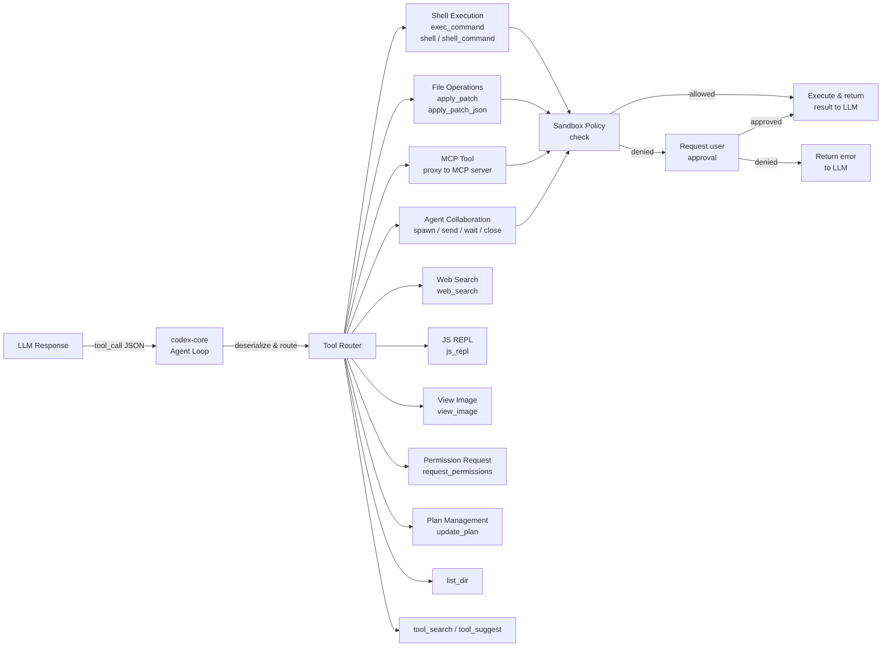
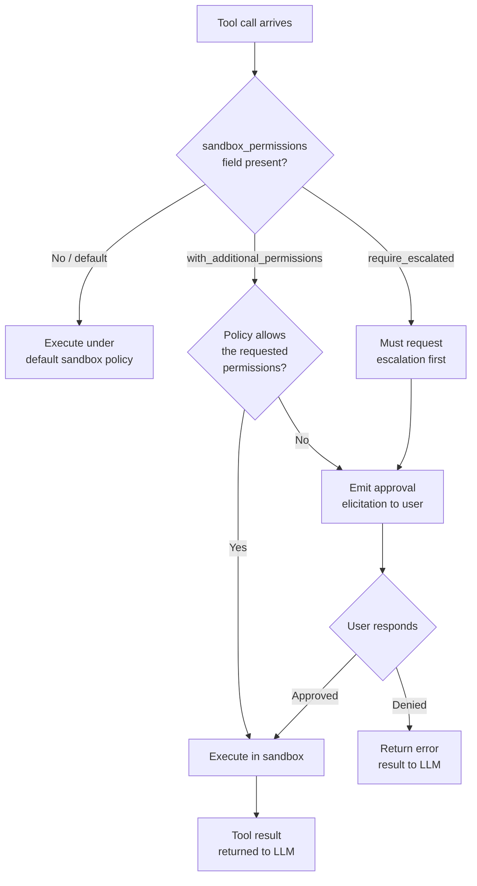
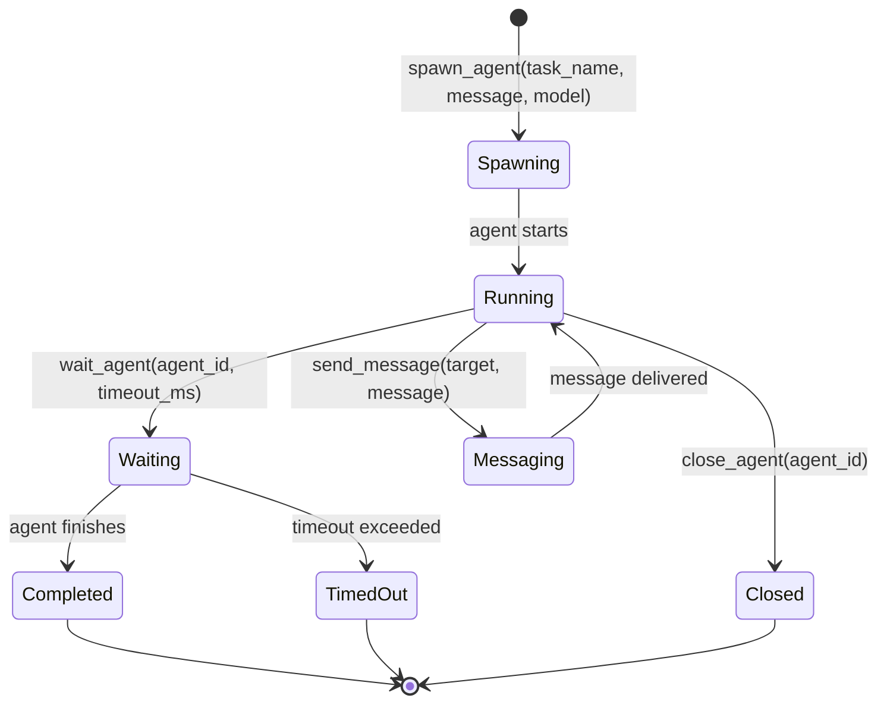
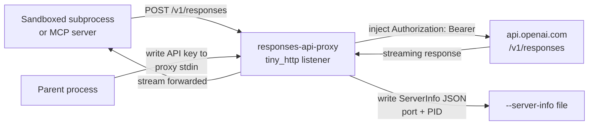

# Tool System & LLM Integration

This document describes how Codex defines, routes, and executes tools — the mechanism
by which the language model takes action in the world. It covers the type system,
permission model, shell execution variants, multi-agent collaboration tools, the Responses
API proxy, and the connector directory.

---

## Overview

The tool system is the bridge between LLM output and side effects. When the model
generates a tool call, the core deserializes the call, checks sandbox permissions, routes
to the correct handler, executes the action, and returns the result as the next model
input. Every tool is defined as a JSON Schema function definition sent to the model in
the request. The model never calls tools directly — it emits structured JSON that the
agent loop interprets.

The `codex-tools` crate owns all tool specifications. It is deliberately separate from
`codex-core` so that tool definitions can be shared across the CLI, MCP server, and IDE
extension without pulling in the full agent runtime.

---

## Tool Architecture



---

## Tool Catalog

### Shell Execution

| Tool Name | Creator Function | Description |
|-----------|-----------------|-------------|
| `exec_command` | `create_exec_command_tool()` | PTY-capable command execution with optional TTY allocation |
| `shell` | `create_shell_tool()` | Direct `execvp`-style execution, no shell interpolation |
| `shell_command` | `create_shell_command_tool()` | Runs via the user's default shell (`$SHELL`) |
| `write_stdin` | `create_write_stdin_tool()` | Write bytes to a running process's stdin |
| `local_shell` | `create_local_shell_tool()` | Native `LocalShell` tool type for trusted local execution |

### File Operations

| Tool Name | Creator Function | Description |
|-----------|-----------------|-------------|
| `apply_patch` | `create_apply_patch_freeform_tool()` | Apply a unified diff patch in free-form text |
| `apply_patch_json` | `create_apply_patch_json_tool()` | Apply a structured JSON patch operation |

### Agent Collaboration

| Tool Name | Creator Function | Description |
|-----------|-----------------|-------------|
| `spawn_agent` (v1) | `create_spawn_agent_tool_v1()` | Spawn a sub-agent, returns agent ID |
| `spawn_agent` (v2) | `create_spawn_agent_tool_v2()` | Spawn with explicit `task_name`, returns canonical name |
| `send_message` | `create_send_message_tool()` | Send a message to a running agent |
| `wait_agent` (v1/v2) | `create_wait_agent_tool_v1/v2()` | Block until an agent completes or times out |
| `close_agent` (v1/v2) | `create_close_agent_tool_v1/v2()` | Terminate a running agent |
| `list_agents` | `create_list_agents_tool()` | List all active agents in the session |
| `assign_task` | `create_assign_task_tool()` | Assign a new task to an existing agent |
| `resume_agent` | `create_resume_agent_tool()` | Resume a paused agent |
| `spawn_agents_on_csv` | `create_spawn_agents_on_csv_tool()` | Batch-spawn agents from CSV input |
| `report_agent_job_result` | `create_report_agent_job_result_tool()` | Report completion of an agent job |

### MCP Tools

| Tool Name | Creator Function | Description |
|-----------|-----------------|-------------|
| `<server>__<tool>` | `parse_mcp_tool()` | Proxy call to a configured MCP server |
| `list_mcp_resources` | `create_list_mcp_resources_tool()` | List available resources on an MCP server |
| `read_mcp_resource` | `create_read_mcp_resource_tool()` | Read a specific MCP resource by URI |
| `list_mcp_resource_templates` | `create_list_mcp_resource_templates_tool()` | List resource URI templates |

### Discovery & Search

| Tool Name | Creator Function | Description |
|-----------|-----------------|-------------|
| `tool_search` | `create_tool_search_tool()` | Search for available tools by capability description |
| `tool_suggest` | `create_tool_suggest_tool()` | Suggest tools for a given task |

### Utility & Productivity

| Tool Name | Creator Function | Description |
|-----------|-----------------|-------------|
| `web_search` | `create_web_search_tool()` | Web search (cached or live via `external_web_access`) |
| `view_image` | `create_view_image_tool()` | View an image file at a path |
| `js_repl` | `create_js_repl_tool()` | Execute JavaScript in a V8 REPL |
| `js_repl_reset` | `create_js_repl_reset_tool()` | Reset the JS REPL state |
| `list_dir` | — | List directory contents |
| `update_plan` | `create_update_plan_tool()` | Update the agent's working plan |
| `image_generation` | `create_image_generation_tool()` | Generate an image |
| `request_permissions` | `create_request_permissions_tool()` | Request additional sandbox permissions at runtime |
| `request_user_input` | `create_request_user_input_tool()` | Ask the user a question |

---

## Tool Type System

### ToolSpec

`ToolSpec` is the top-level enum serialized as the `type`-tagged JSON sent to the model:

```rust
pub enum ToolSpec {
    Function(ResponsesApiTool),        // type: "function" — standard function call
    ToolSearch { .. },                 // type: "tool_search"
    LocalShell {},                     // type: "local_shell"
    ImageGeneration { output_format }, // type: "image_generation"
    WebSearch { .. },                  // type: "web_search"
    Freeform(FreeformTool),            // type: "custom"
}
```

### ResponsesApiTool

The `Function` variant wraps `ResponsesApiTool`:

```rust
pub struct ResponsesApiTool {
    pub name: String,
    pub description: String,
    pub strict: bool,
    pub defer_loading: Option<bool>,
    pub parameters: JsonSchema,
    pub output_schema: Option<JsonSchema>,
}
```

`strict: false` means the model may omit optional parameters. `defer_loading` hints to
the runtime that the tool definition should be fetched lazily.

### JsonSchema

`JsonSchema` is a recursive enum matching the OpenAI tool parameter schema format:

```rust
pub enum JsonSchema {
    String  { description: Option<String> },
    Number  { description: Option<String> },
    Boolean { description: Option<String> },
    Array   { items: Box<JsonSchema>, description: Option<String> },
    Object  {
        properties: BTreeMap<String, JsonSchema>,
        required: Option<Vec<String>>,
        additional_properties: Option<AdditionalProperties>,
    },
}
```

Example — the `exec_command` tool's parameter schema:

```json
{
  "type": "object",
  "properties": {
    "cmd":             { "type": "string", "description": "Shell command to execute." },
    "workdir":         { "type": "string", "description": "Optional working directory." },
    "tty":             { "type": "boolean", "description": "Allocate a PTY." },
    "yield_time_ms":   { "type": "number", "description": "Milliseconds to wait for output." },
    "max_output_tokens": { "type": "number", "description": "Truncation limit." }
  },
  "required": ["cmd"]
}
```

---

## Tool Permission Model



The `additional_permissions` schema passed to `create_request_permissions_tool()` captures
two orthogonal axes:

| Permission Type | Description |
|-----------------|-------------|
| `filesystem` | Read/write access to paths outside the default working tree |
| `network` | Outbound network requests to specified hosts |

The `justification` field in the permission request is shown to the user verbatim, so the
LLM is expected to provide a plain-English reason for the escalation request.

---

## Shell Execution Tools

Three distinct mechanisms handle command execution, each suited to different use cases:

| Tool | Mechanism | Shell | Use Case |
|------|-----------|-------|----------|
| `exec_command` | PTY (`tty: true`) or plain pipes | Configurable via `shell` param | Interactive commands, programs that detect TTY |
| `shell` | `execvp` — direct exec, no shell | No shell wrapping | Fast, predictable, no glob expansion |
| `shell_command` | `$SHELL -c <cmd>` | User's login shell | Commands that require shell features (pipes, redirects) |
| `write_stdin` | Write to existing process fd | N/A | Send input to a waiting interactive process |

`exec_command` is the most capable: setting `tty: true` allocates a PTY so programs like
`vim`, `top`, or color-output tools behave correctly. `yield_time_ms` controls how long
to wait for output before yielding back to the model (useful for long-running commands).
`max_output_tokens` applies truncation so large outputs do not flood the context window.

`ShellToolOptions` and `CommandToolOptions` carry `exec_permission_approvals_enabled`
which gates whether the approval parameters (`sandbox_permissions`, `justification`,
`prefix_rule`) are included in the tool schema at all.

---

## Multi-Agent Collaboration Tools

The agent collaboration tools implement a supervisor/worker model within a single Codex
session. The orchestrator agent spawns workers, sends them messages, and waits for results.



**v1 vs v2 distinction:**

- `spawn_agent_tool_v1` — Returns a numeric agent ID. Used in older protocol versions.
- `spawn_agent_tool_v2` — Requires an explicit `task_name` (lowercase, digits, underscores)
  and returns the canonical task name. Preferred for new implementations.

`WaitAgentTimeoutOptions` constrains `default_timeout_ms`, `min_timeout_ms`, and
`max_timeout_ms` to prevent the orchestrator from waiting indefinitely or spinning too
fast.

`SpawnAgentToolOptions` carries `available_models` so the spawn tool's description
dynamically lists which models can be assigned to workers.

---

## Responses API Proxy

The `codex-responses-api-proxy` crate is a minimal single-purpose HTTP proxy that
injects an API key into outgoing requests. It is designed for environments where the API
key cannot be passed as an environment variable (e.g., sandboxed subprocesses).



### Security Model

- **API key via stdin only.** The proxy calls `read_auth_header_from_stdin()` at startup
  with `set_sensitive(true)`. The key is never passed as a CLI argument or environment
  variable, preventing it from appearing in process listings.
- **Single allowed path.** Only `POST /v1/responses` is forwarded. Any other path or
  method returns an error, preventing the proxy from being used as a general-purpose
  tunnel.
- **Ephemeral port.** If `--port` is not specified, an OS-assigned ephemeral port is
  used. The actual port is written to `--server-info` as `{"port": N, "pid": N}` for
  the parent process to discover.
- **No timeout on upstream.** `reqwest::blocking::Client` is built with
  `timeout(None)` so long-lived streaming responses are not interrupted.

### CLI Arguments

| Argument | Default | Description |
|----------|---------|-------------|
| `--port` | ephemeral | TCP port to listen on |
| `--server-info <FILE>` | none | JSON file path for port/PID announcement |
| `--upstream-url` | `https://api.openai.com/v1/responses` | Override upstream URL |
| `--http-shutdown` | false | Enable `GET /shutdown` for graceful stop |

---

## Connector Directory

The `codex-connectors` crate (`connectors/src/lib.rs`) provides a cached directory of
available tool connectors — external integrations (apps, services) that can be surfaced
as tools.

`list_all_connectors_with_options()` accepts a `fetch_page` async closure and:

1. Calls `fetch_page` repeatedly with pagination cursors until exhausted.
2. Merges results from both the workspace scope and directory scope.
3. Normalizes `DirectoryApp` records into a uniform `AppInfo` representation.
4. Caches the result in an `Arc<Mutex<...>>` map keyed by `AllConnectorsCacheKey`.
5. Returns cached results for TTL of 1 hour before re-fetching.

`ToolSearchAppInfo` and `ToolSearchAppSource` (defined in `codex-tools`) carry the
normalized app metadata used by `create_tool_search_tool()` to populate the model's
tool catalog dynamically.

---

## Key Files

| File | Crate | Purpose |
|------|-------|---------|
| `tools/src/tool_spec.rs` | `codex-tools` | `ToolSpec` enum, `create_web_search_tool`, `create_local_shell_tool` |
| `tools/src/responses_api.rs` | `codex-tools` | `ResponsesApiTool`, `FreeformTool`, serialization helpers |
| `tools/src/json_schema.rs` | `codex-tools` | `JsonSchema` recursive enum, `parse_tool_input_schema` |
| `tools/src/local_tool.rs` | `codex-tools` | `create_exec_command_tool`, `create_shell_tool`, `create_shell_command_tool`, `create_write_stdin_tool`, `create_request_permissions_tool` |
| `tools/src/apply_patch_tool.rs` | `codex-tools` | `create_apply_patch_freeform_tool`, `create_apply_patch_json_tool` |
| `tools/src/agent_tool.rs` | `codex-tools` | All spawn/send/wait/close/list agent tools |
| `tools/src/mcp_tool.rs` | `codex-tools` | `parse_mcp_tool`, MCP call result output schema |
| `tools/src/mcp_resource_tool.rs` | `codex-tools` | MCP resource list/read tools |
| `tools/src/tool_discovery.rs` | `codex-tools` | `create_tool_search_tool`, `create_tool_suggest_tool`, connector infos |
| `tools/src/plan_tool.rs` | `codex-tools` | `create_update_plan_tool` |
| `tools/src/js_repl_tool.rs` | `codex-tools` | `create_js_repl_tool`, `create_js_repl_reset_tool` |
| `tools/src/view_image.rs` | `codex-tools` | `create_view_image_tool` |
| `responses-api-proxy/src/lib.rs` | `codex-responses-api-proxy` | Proxy server, `Args`, `ServerInfo`, `forward_request` |
| `responses-api-proxy/src/read_api_key.rs` | `codex-responses-api-proxy` | Stdin API key reader |
| `connectors/src/lib.rs` | `codex-connectors` | `list_all_connectors_with_options`, caching, normalization |

---

## Integration Points

- [06 — Authentication](./06-auth-login.md) — `ApiKeyAuth` is used by the Responses API
  proxy; the proxy provides an API key injection alternative for sandboxed processes.
- [08 — MCP](./08-mcp.md) — `parse_mcp_tool()` creates tool specs from MCP server tool
  listings; MCP resource tools use the same `JsonSchema` type system.
- [05 — Agent Core](./05-agent-core.md) — The agent loop calls `create_tools_json_for_responses_api()`
  to assemble the tool list sent with each model request.

---

_Last updated: sourced from [github.com/openai/codex](https://github.com/openai/codex) `main` branch._
