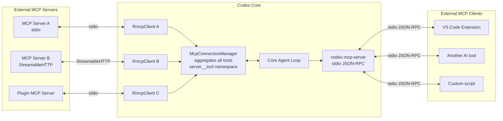
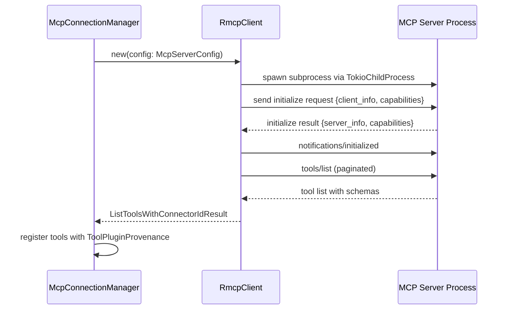
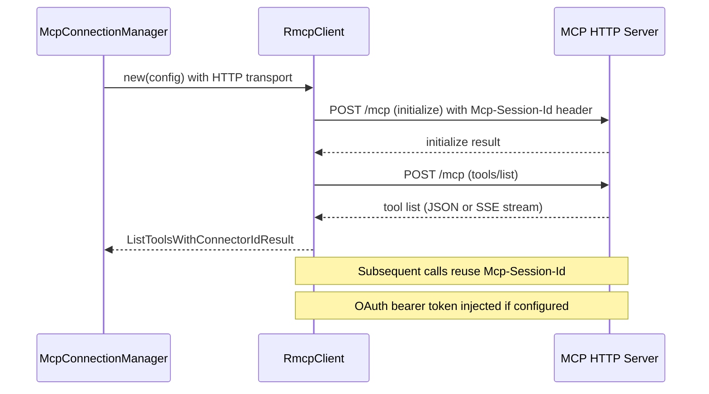
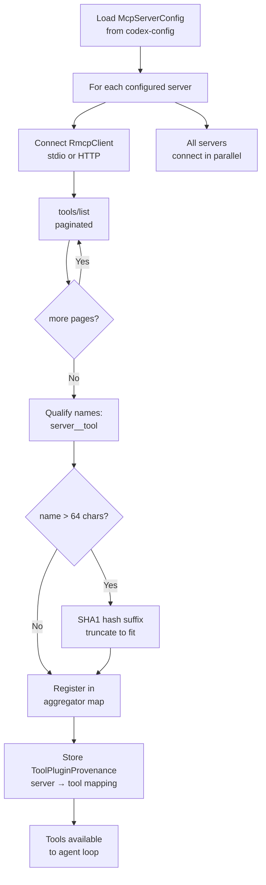
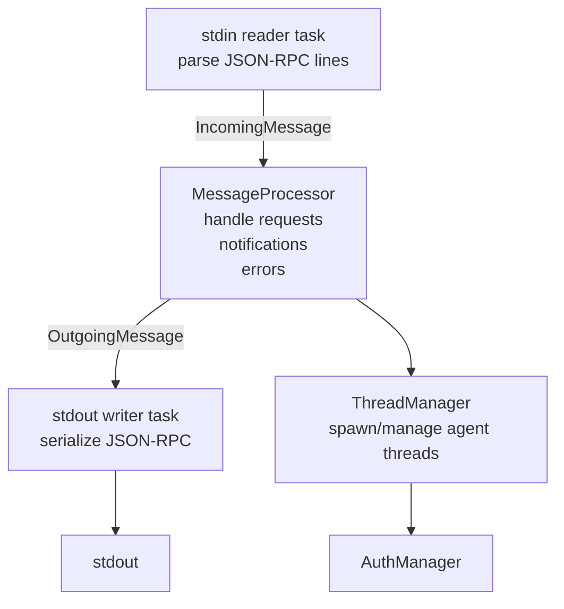
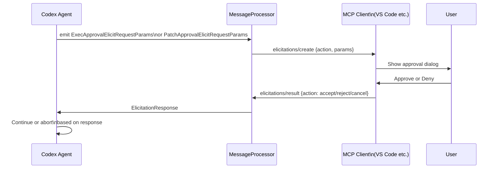
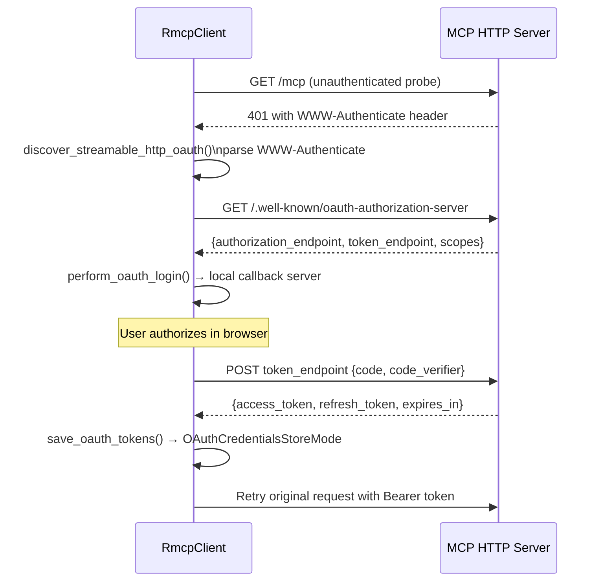

# Model Context Protocol (MCP)

This document explains Codex's bidirectional MCP architecture: how Codex connects to
external MCP servers as a client, and how it exposes its own capabilities as an MCP
server for IDE extensions and other tools.

---

## Overview

Codex implements MCP in both directions simultaneously:

- **As an MCP client** (`codex-mcp` + `codex-rmcp-client`): Codex connects to one or
  more configured external MCP servers, aggregates their tools into a unified namespace,
  and calls them during agent turns as if they were native tools.

- **As an MCP server** (`codex-mcp-server`): Codex exposes its own tools over stdio
  JSON-RPC. Any MCP-compatible client — VS Code extensions, other AI tools, custom
  scripts — can connect to Codex and invoke its full tool suite.

This bidirectional design means Codex can sit in the middle of a chain: consuming tools
from upstream MCP servers while simultaneously offering its own capabilities downstream.

---

## Bidirectional MCP Architecture



---

## Codex as MCP Client

### McpConnectionManager

`McpConnectionManager` (`codex-mcp/src/mcp_connection_manager.rs`) is the central
aggregator. It:

- Owns one `RmcpClient` per configured MCP server, keyed by server name.
- Lists tools from all connected servers and merges them into a single map.
- Qualifies every tool name as `<server_name><delimiter><tool_name>` where the delimiter
  is `__` (double underscore — required because OpenAI tool names must match
  `^[a-zA-Z0-9_-]+$`).
- Enforces a 64-character maximum on qualified tool names by hashing long names.
- Tracks which server provided each tool via `ToolPluginProvenance`.

The initialization sequence connects all configured servers concurrently and emits
`McpStartupUpdateEvent` / `McpStartupCompleteEvent` to the agent's event stream so the
UI can show startup progress.

### Tool Namespace

| Component | Example |
|-----------|---------|
| Server name | `github` |
| Delimiter | `__` |
| Tool name | `create_issue` |
| Qualified name | `github__create_issue` |

When the agent calls `github__create_issue`, `McpConnectionManager` strips the prefix,
looks up the `RmcpClient` for `github`, and forwards the call.

### Supported Transports

| Transport | Config Key | Description |
|-----------|-----------|-------------|
| `stdio` | `McpServerTransportConfig::Stdio` | Spawns the server as a subprocess; communicates via stdin/stdout |
| `StreamableHTTP` | `McpServerTransportConfig::Http` | Connects to a running HTTP server; supports SSE streaming |

Both transports are handled by `RmcpClient`, which wraps the `rmcp` library's
`TokioChildProcess` (for stdio) and `StreamableHttpClientTransport` (for HTTP).

---

## Transport Details

### Stdio Transport — Connection Setup



### StreamableHTTP Transport — Connection Setup



The HTTP transport uses `Last-Event-Id` for SSE reconnection and `Mcp-Session-Id` for
session continuity across requests.

---

## Tool Discovery and Aggregation



After aggregation, the complete tool map is passed to `create_tools_json_for_responses_api()`
in `codex-tools` alongside native tools. The model sees MCP tools and native tools
identically — they are all function definitions in the same array.

---

## Codex as MCP Server

### Three-Task Architecture

`codex-mcp-server` runs three concurrent Tokio tasks connected by bounded channels
(`CHANNEL_CAPACITY = 128`):



The stdin reader deserializes each newline-delimited JSON-RPC message into
`JsonRpcMessage<ClientRequest, Value, ClientNotification>`. The `MessageProcessor`
handles:

- `initialize` — returns server capabilities including `ToolsCapability`
- `tools/list` — returns the two special tools (`codex_tool_call` and
  `codex_tool_call_reply`) that represent a full Codex interaction
- `tools/call` — routes to `codex_tool_runner`, which dispatches to a `ThreadManager`
  thread and awaits the result
- Notifications — forwarded to the active thread if one exists

### Tool Exposure

The MCP server exposes Codex's interface as two tools:

| Tool | Param Type | Description |
|------|-----------|-------------|
| `codex_tool_call` | `CodexToolCallParam` | Submit a new task to a Codex agent thread |
| `codex_tool_call_reply` | `CodexToolCallReplyParam` | Send a reply to a waiting agent |

The `MessageProcessor` maps each incoming `RequestId` to an internal Codex `ThreadId`,
enabling multiple concurrent MCP client requests to run as independent agent threads.

---

## Elicitation Flow

When a Codex agent needs to ask for human approval (e.g., before executing a shell
command or applying a patch), it emits an elicitation request through the MCP server to
the connected client.



`ExecApprovalElicitRequestParams` carries the command string and sandbox context.
`PatchApprovalElicitRequestParams` carries the diff to be applied.

The `ElicitationAction` enum from the `rmcp` library maps to:
- `accept` — user approved
- `reject` — user denied
- `cancel` — user dismissed without deciding (treated as deny)

---

## MCP OAuth

MCP servers using the StreamableHTTP transport can require OAuth authentication.
`codex-rmcp-client` handles this with its own OAuth flow separate from the ChatGPT login.

### OAuth Discovery



`determine_streamable_http_auth_status()` and `supports_oauth_login()` check whether
a given server URL requires OAuth before attempting connection.

### Token Storage

`OAuthCredentialsStoreMode` controls where MCP OAuth tokens are persisted:

| Mode | Storage |
|------|---------|
| `Keyring` | OS keyring (same `KeyringStore` as ChatGPT tokens) |
| `File` | `~/.codex/mcp_oauth/<server_name>.json` |
| `Memory` | In-process only, lost on restart |

`StoredOAuthTokens` wraps `WrappedOAuthTokenResponse` and adds a computed
`expires_at_millis` field for expiry checking without re-parsing.

---

## MCP Configuration

MCP servers are declared in `~/.codex/config.toml` (or project-level `codex.toml`)
under the `[mcp_servers]` table.

### McpServerConfig Fields

| Field | Type | Description |
|-------|------|-------------|
| `command` | `String` | Executable to launch (for stdio transport) |
| `args` | `Vec<String>` | Arguments passed to the executable |
| `env` | `HashMap<String, String>` | Environment variables for the subprocess |
| `transport` | `McpServerTransportConfig` | `Stdio` or `Http { url }` |
| `timeout_ms` | `Option<u64>` | Connection timeout (default: built-in constant) |
| `disabled` | `bool` | Skip this server without removing its config |

### Adding a Server — stdio example

```toml
[mcp_servers.filesystem]
command = "npx"
args = ["-y", "@modelcontextprotocol/server-filesystem", "/projects"]

[mcp_servers.github]
command = "npx"
args = ["-y", "@modelcontextprotocol/server-github"]
env = { GITHUB_TOKEN = "${GITHUB_TOKEN}" }
```

### Adding a Server — StreamableHTTP example

```toml
[mcp_servers.my_api]
transport = { type = "http", url = "https://my-mcp-server.example.com/mcp" }
```

`program_resolver.rs` handles resolving relative command paths against `PATH` and
platform-specific executable extensions (`.exe` on Windows).

---

## Plugin-provided MCP Servers

Plugins can declare their own MCP servers via `PluginCapabilitySummary`. When a plugin
is loaded, `codex-mcp`'s `skill_dependencies.rs` inspects the plugin's capabilities and
adds the declared MCP server configs to the effective server list alongside user-configured
servers.

The `CODEX_APPS_MCP_SERVER_NAME` constant is the reserved name for the built-in connectors
MCP server that exposes installed app integrations (managed by `codex-connectors`).

Effective servers are computed by `effective_mcp_servers()`, which merges:
1. User-configured servers from `codex-config`
2. Plugin-declared servers from loaded plugins
3. The built-in connectors server (if apps are available)

`configured_mcp_servers()` returns only explicitly user-configured servers, excluding
plugin-injected ones.

---

## Key Files

| File | Crate | Purpose |
|------|-------|---------|
| `codex-mcp/src/mcp_connection_manager.rs` | `codex-mcp` | `McpConnectionManager`, tool aggregation, namespace qualification |
| `codex-mcp/src/mcp/mod.rs` | `codex-mcp` | `McpConfig`, `ToolPluginProvenance`, `MCP_TOOL_NAME_DELIMITER` |
| `codex-mcp/src/mcp/auth.rs` | `codex-mcp` | `McpAuthStatusEntry`, auth state tracking per server |
| `codex-mcp/src/mcp/skill_dependencies.rs` | `codex-mcp` | Plugin-declared MCP server injection |
| `mcp-server/src/lib.rs` | `codex-mcp-server` | Three-task stdio JSON-RPC server, `run_main` |
| `mcp-server/src/message_processor.rs` | `codex-mcp-server` | `MessageProcessor`, request routing, `ThreadManager` integration |
| `mcp-server/src/codex_tool_config.rs` | `codex-mcp-server` | `CodexToolCallParam`, `CodexToolCallReplyParam`, tool definitions |
| `mcp-server/src/exec_approval.rs` | `codex-mcp-server` | `ExecApprovalElicitRequestParams`, `ExecApprovalResponse` |
| `mcp-server/src/patch_approval.rs` | `codex-mcp-server` | `PatchApprovalElicitRequestParams`, `PatchApprovalResponse` |
| `rmcp-client/src/rmcp_client.rs` | `codex-rmcp-client` | `RmcpClient`, stdio + HTTP transport, `Elicitation` types |
| `rmcp-client/src/perform_oauth_login.rs` | `codex-rmcp-client` | `perform_oauth_login`, callback server, token exchange |
| `rmcp-client/src/auth_status.rs` | `codex-rmcp-client` | `discover_streamable_http_oauth`, `supports_oauth_login` |
| `rmcp-client/src/oauth.rs` | `codex-rmcp-client` | `StoredOAuthTokens`, `OAuthCredentialsStoreMode`, persistence |
| `rmcp-client/src/program_resolver.rs` | `codex-rmcp-client` | MCP server executable path resolution |
| `config/src/…` | `codex-config` | `McpServerConfig`, `McpServerTransportConfig`, `RawMcpServerConfig` |

---

## Integration Points

- [06 — Authentication](./06-auth-login.md) — MCP OAuth uses the same `KeyringStore`
  infrastructure as ChatGPT login. The `OAuthCredentialsStoreMode::Keyring` variant
  delegates to `DefaultKeyringStore`.
- [07 — Tool System](./07-tools-system.md) — `parse_mcp_tool()` creates `ToolSpec`
  entries from MCP server tool listings. MCP resource tools (`list_mcp_resources`,
  `read_mcp_resource`) are defined in `codex-tools` and dispatched through
  `McpConnectionManager`.
- [05 — Agent Core](./05-agent-core.md) — `McpConnectionManager` is initialized as part
  of the agent core startup sequence. `McpStartupCompleteEvent` gates the agent from
  accepting its first turn until all servers have initialized (or timed out).

---

_Last updated: sourced from [github.com/openai/codex](https://github.com/openai/codex) `main` branch._
