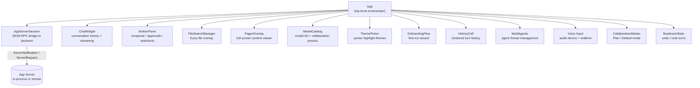
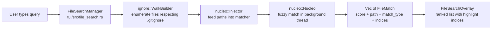
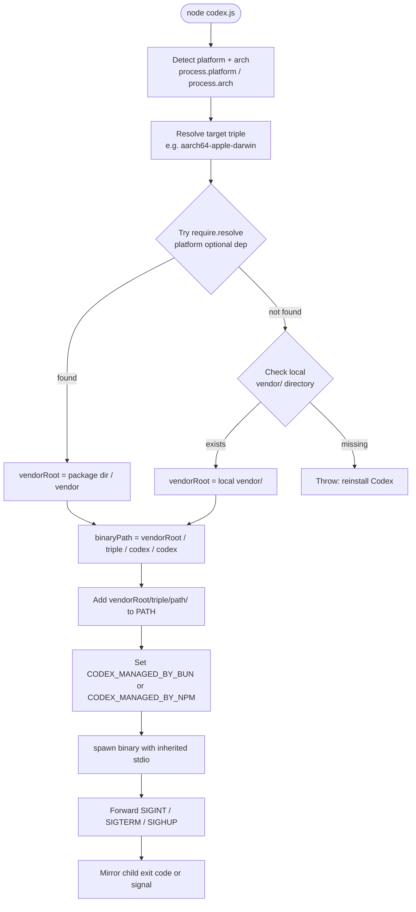

# 09 — CLI, TUI & User Interface

> **Last updated:** references [`github.com/openai/codex`](https://github.com/openai/codex) `main` branch.  
> **Related docs:** [Core Engine](01-core-engine.md) · [Config & State](10-config-state.md) · [Security & Sandboxing](04-security-sandboxing.md)

---

## Overview

Codex exposes three layered entry points that work together to deliver the user-facing experience:

1. **JS distribution wrapper** (`codex-cli/bin/codex.js`): An ESM Node.js script that detects the current platform and architecture, resolves the correct pre-compiled native binary from an optional npm package or a local vendor directory, then spawns it and forwards signals.

2. **CLI** (`codex-rs/cli`): The native Rust binary. Parses arguments with `clap` via the `MultitoolCli` struct. When no subcommand is provided it launches the TUI; named subcommands dispatch to their own command handlers.

3. **TUI** (`codex-rs/tui`): A ratatui-based terminal user interface (~80+ source files) built around the `App` struct. It manages the chat session, overlays, collaboration modes, voice, and all interactive rendering.

---

## CLI Subcommand Dispatch

The top-level `MultitoolCli` clap struct embeds `CliConfigOverrides`, `FeatureToggles`, `InteractiveRemoteOptions`, and a flattened `TuiCli`. When the parser finds a subcommand it routes to the appropriate handler; otherwise it initialises the TUI.

```mermaid
flowchart TD
    Start([codex invoked]) --> Parse[clap: MultitoolCli parse]
    Parse --> HasSub{subcommand?}

    HasSub -- no --> TUI[Launch TUI\ncodex-tui App]

    HasSub -- exec / e --> Exec[ExecCli\nnon-interactive agent run]
    HasSub -- review --> Review[ReviewArgs\nnon-interactive code review]
    HasSub -- login --> Login[LoginCommand\nAPI key / device auth / ChatGPT OAuth]
    HasSub -- logout --> Logout[LogoutCommand\nremove stored credentials]
    HasSub -- mcp --> Mcp[McpCli\nadd / list / remove MCP servers]
    HasSub -- mcp-server --> McpServer[Start Codex as MCP server stdio]
    HasSub -- app-server --> AppServer[AppServerCommand\nrun or debug app server]
    HasSub -- app --> App[macOS only\nAppCommand: launch desktop app]
    HasSub -- completion --> Completion[CompletionCommand\ngenerate shell completions]
    HasSub -- sandbox --> Sandbox[SandboxArgs\nseatbelt / landlock / windows]
    HasSub -- debug --> Debug[DebugCommand\napp-server tooling]
    HasSub -- execpolicy --> Execpolicy[ExecPolicyCheckCommand]
    HasSub -- apply / a --> Apply[ApplyCommand\ngit apply latest diff]
    HasSub -- resume --> Resume[ResumeCommand\nresume previous session]
    HasSub -- fork --> Fork[ForkCommand\nfork previous session]
    HasSub -- cloud --> Cloud[CloudTasksCli\nCodex Cloud tasks]
    HasSub -- responses-api-proxy --> Proxy[ResponsesApiProxyArgs\ninternal proxy]
    HasSub -- stdio-to-uds --> StdioUds[StdioToUdsCommand\nrelay stdio to Unix socket]
    HasSub -- features --> Features[FeaturesCli\ninspect feature flags]
```



### Platform-Specific Sandbox Wrappers

The `sandbox` subcommand delegates to one of three platform-specific structs:

| Struct | Platform | Mechanism |
|---|---|---|
| `SeatbeltCommand` | macOS | Apple Seatbelt (sandbox-exec) |
| `LandlockCommand` | Linux | Landlock LSM / bubblewrap |
| `WindowsCommand` | Windows | Restricted token |

---

## TUI Component Architecture

The `App` struct is the top-level TUI orchestrator. It owns or borrows every major widget and delegates rendering, event handling, and state transitions.



### Key App Types

| Type | Location | Purpose |
|---|---|---|
| `App` | `tui/src/app.rs` | Orchestrates TUI lifecycle and all widgets |
| `AppEvent` | `tui/src/app_event.rs` | Input events: key press, server notification, audio, etc. |
| `AppCommand` | `tui/src/app_command.rs` | Actions dispatched by widgets back to `App` |
| `AppExitInfo` | `tui/src/lib.rs` | Exit reason exported to the CLI |
| `ExitReason` | `tui/src/lib.rs` | Enum: `Quit`, `NewSession`, `ForkSession`, `Resume`, etc. |

---

## TUI Rendering Pipeline

Codex uses the standard ratatui draw loop, augmented with a reactive event/command pattern.

```
Terminal event loop
│
├─ crossterm events ──► TuiEvent (Key, Mouse, Resize, Paste)
│                              │
│                              ▼
├─ server notifications ──► AppEvent
│                              │
│                              ▼
│                           App::update()
│                              │
│                    ┌─────────┴──────────┐
│                    │ state mutations     │
│                    │ AppCommand dispatch │
│                    └─────────┬──────────┘
│                              │
│                              ▼
└─ terminal.draw() ──► App::render()
                           │
                    ratatui widget tree
                    (ChatWidget, BottomPane, overlays)
```

**Key characteristics:**

- **Alternate-screen mode** is the default; `--no-alt-screen` enables inline mode for terminal multiplexers.
- **Shimmer animations** (`shimmer.rs`) run on a timer tick between draw cycles.
- **Streaming markdown** (`markdown_stream.rs`) renders token-by-token as the model responds.
- **Diff rendering** (`diff_render.rs`) produces colour-coded unified diffs inline in the chat history.
- **Status indicators** (`status_indicator_widget.rs`) show rate-limit snapshots, model name, token usage.

---

## App Server Session

`AppServerSession` (`tui/src/app_server_session.rs`) is the TUI's sole data bridge to the agent backend. It wraps `AppServerClient` and translates JSON-RPC messages into typed Rust values.

### Connection Modes

| Mode | Description | When Used |
|---|---|---|
| **In-process** | Backend runs in the same OS process; communication over Tokio channels | Default for `codex` interactive launch |
| **Remote (WebSocket / stdio)** | Backend runs in a separate process or on a remote host | `--remote` flag or app-server subcommand |

### Message Flow

```
TUI widget sends ClientRequest
       │
       ▼
AppServerSession::request()
       │ JSON-RPC over transport
       ▼
App Server (codex-app-server crate)
       │
       ▼
AppServerRequestHandle::await response
       │
       ▼
ServerNotification / ServerRequest dispatched
       │
       ▼
AppEvent queued into TUI event loop
```

`AppServerStartedThread` tracks a thread-level session state (`ThreadSessionState`) which holds the current thread ID, rate-limit snapshots, and streaming turn state.

---

## Collaboration Modes

Collaboration modes (`collaboration_modes.rs`) control how the agent behaves and which UI affordances are active.

| Mode | `ModeKind` | Agent behaviour | UI differences |
|---|---|---|---|
| **Default** | `ModeKind::Default` | Executes tasks autonomously, requests approvals per policy | Normal turn flow |
| **Plan** | `ModeKind::Plan` | Produces a plan before acting; user reviews before execution | Plan summary shown; `/plan` slash command activates |

Modes are represented as `CollaborationModeMask` structs from `ModelCatalog::list_collaboration_modes()`. Only modes where `ModeKind::is_tui_visible()` returns `true` are surfaced in the UI. The `/collab` slash command cycles through available modes.

---

## File Search

The `codex-file-search` crate provides the fuzzy file picker used in the TUI's file-search overlay.



**`FileMatch` fields:**

| Field | Type | Description |
|---|---|---|
| `score` | `u32` | Relevance score from nucleo |
| `path` | `PathBuf` | Path relative to search root |
| `match_type` | `MatchType` | `File` or `Directory` |
| `root` | `PathBuf` | Search root directory |
| `indices` | `Option<Vec<u32>>` | Matched character positions for highlight |

The walker runs in a dedicated background thread. A configurable timeout gates how long collection waits before returning partial results.

---

## Slash Commands

Slash commands are defined in `tui/src/slash_command.rs` as the `SlashCommand` enum. They are invoked by typing `/` followed by the command name in the composer.

| Command | Description | Available During Task |
|---|---|---|
| `/model` | Choose model and reasoning effort | No |
| `/fast` | Toggle Fast mode (fastest inference at 2x plan usage) | No |
| `/approvals` / `/permissions` | Configure what Codex is allowed to do | No |
| `/setup-default-sandbox` | Set up elevated agent sandbox | No |
| `/experimental` | Toggle experimental features | No |
| `/skills` | Use skills to improve specific tasks | Yes |
| `/review` | Review current changes and find issues | No |
| `/rename` | Rename the current thread | Yes |
| `/new` | Start a new chat | No |
| `/resume` | Resume a saved chat | No |
| `/fork` | Fork the current chat | No |
| `/init` | Create an AGENTS.md file | No |
| `/compact` | Summarize conversation to avoid context limit | No |
| `/plan` | Switch to Plan mode | No |
| `/collab` | Change collaboration mode | Yes |
| `/agent` / `/subagents` | Switch active agent thread | Yes |
| `/diff` | Show git diff including untracked files | Yes |
| `/copy` | Copy latest Codex output to clipboard | Yes |
| `/mention` | Mention a file | Yes |
| `/status` | Show session config and token usage | Yes |
| `/debug-config` | Show config layers for debugging | Yes |
| `/theme` | Choose syntax highlighting theme | No |
| `/mcp` | List configured MCP tools | Yes |
| `/apps` | Manage apps | Yes |
| `/plugins` | Browse plugins | Yes |
| `/realtime` | Toggle realtime voice mode | Yes |
| `/settings` | Configure microphone/speaker | Yes |
| `/personality` | Choose communication style | No |
| `/feedback` | Send logs to maintainers | Yes |
| `/quit` / `/exit` | Exit Codex | Yes |
| `/stop` / `/clean` | Stop all background terminals | Yes |
| `/logout` | Log out of Codex | No |

Commands marked "No" for "Available During Task" are blocked while an agent turn is in progress.

---

## JS Distribution Wrapper

`codex-cli/bin/codex.js` is the ESM entry point installed by the `@openai/codex` npm package. It abstracts platform detection and binary resolution.



The wrapper uses async `spawn` (not `spawnSync`) so Node.js can respond to OS signals while the native child is running. On exit, if the child was killed by a signal the parent re-emits that same signal to set the correct `128+n` exit status.

---

## Supported Platforms Table

| Platform | Architecture | npm Package | Target Triple | Binary Name |
|---|---|---|---|---|
| Linux | x64 | `@openai/codex-linux-x64` | `x86_64-unknown-linux-musl` | `codex` |
| Linux | arm64 | `@openai/codex-linux-arm64` | `aarch64-unknown-linux-musl` | `codex` |
| macOS | x64 | `@openai/codex-darwin-x64` | `x86_64-apple-darwin` | `codex` |
| macOS | arm64 | `@openai/codex-darwin-arm64` | `aarch64-apple-darwin` | `codex` |
| Windows | x64 | `@openai/codex-win32-x64` | `x86_64-pc-windows-msvc` | `codex.exe` |
| Windows | arm64 | `@openai/codex-win32-arm64` | `aarch64-pc-windows-msvc` | `codex.exe` |

Android maps to the Linux x64 or arm64 triple depending on architecture. Unsupported platform/arch combinations throw at startup.

---

## Key Files

| File | Crate | Description |
|---|---|---|
| `codex-cli/bin/codex.js` | JS wrapper | ESM entry point; platform detection and binary spawn |
| `codex-rs/cli/src/main.rs` | `codex-cli` | `MultitoolCli` parser and subcommand dispatch |
| `codex-rs/cli/src/lib.rs` | `codex-cli` | `SeatbeltCommand`, `LandlockCommand`, `WindowsCommand` |
| `codex-rs/tui/src/app.rs` | `codex-tui` | `App` struct and main update/render loop |
| `codex-rs/tui/src/app_event.rs` | `codex-tui` | `AppEvent` enum |
| `codex-rs/tui/src/app_command.rs` | `codex-tui` | `AppCommand` enum |
| `codex-rs/tui/src/app_server_session.rs` | `codex-tui` | JSON-RPC bridge to app server backend |
| `codex-rs/tui/src/slash_command.rs` | `codex-tui` | `SlashCommand` enum with descriptions |
| `codex-rs/tui/src/collaboration_modes.rs` | `codex-tui` | Plan / Default mode helpers |
| `codex-rs/tui/src/file_search.rs` | `codex-tui` | `FileSearchManager` overlay integration |
| `codex-rs/file-search/src/lib.rs` | `codex-file-search` | `FileMatch`, `WalkBuilder`, nucleo integration |
| `codex-rs/tui/src/chatwidget.rs` | `codex-tui` | Chat history rendering |
| `codex-rs/tui/src/markdown_stream.rs` | `codex-tui` | Streaming markdown renderer |
| `codex-rs/tui/src/diff_render.rs` | `codex-tui` | Inline diff rendering |
| `codex-rs/tui/src/model_catalog.rs` | `codex-tui` | Model list and collaboration mode presets |

---

## Integration Points

- **App Server Protocol**: The `AppServerSession` communicates with the app server defined in [03-app-server.md](./03-app-server.md).
- **Configuration**: CLI flags feed into `CliConfigOverrides` described in [10-config-state.md](./10-config-state.md).
- **Security & Sandboxing**: The `sandbox` subcommand and `SeatbeltCommand` / `LandlockCommand` / `WindowsCommand` are covered in [04-security-sandboxing.md](./04-security-sandboxing.md).
- **Authentication**: The `login` / `logout` subcommands interact with the auth system described in [06-auth-login.md](./06-auth-login.md).
- **Skills**: The `/skills` slash command surfaces skills loaded by the system described in [11-skills-plugins.md](./11-skills-plugins.md).
- **Observability**: Session telemetry emitted from the TUI is covered in [12-observability.md](./12-observability.md).
