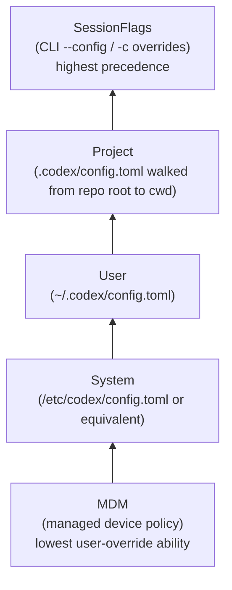
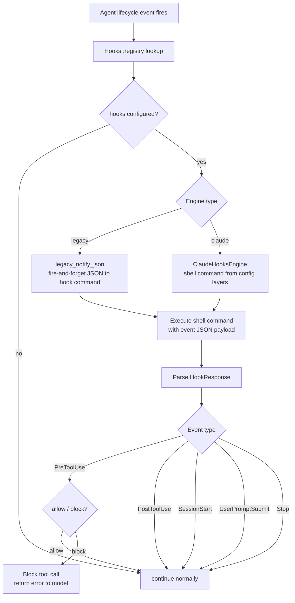

# 10 — Configuration, State & Features

> **Last updated:** references [`github.com/openai/codex`](https://github.com/openai/codex) `main` branch.  
> **Related docs:** [Core Engine](01-core-engine.md) · [CLI/TUI](09-ui-cli-tui.md) · [Skills & Plugins](11-skills-plugins.md)

---

## Overview

Four runtime management systems govern how Codex is configured, what features are active, where state persists, and how lifecycle events trigger hooks:

1. **Configuration** (`codex-config`): A layered TOML stack that merges settings from MDM policies down to per-session CLI flags.
2. **Feature flags** (`codex-features`): A registry of 60+ `Feature` variants each carrying a lifecycle stage, used to gate experimental and in-development behaviour.
3. **SQLite state** (`codex-state`): A local database that persists thread metadata, agent jobs, and rollout index data across sessions.
4. **Hooks & Instructions** (`codex-hooks`, `codex-instructions`): Configurable shell-command hooks fired on session events, plus AGENTS.md-based instruction injection.

---

## Configuration Layer Hierarchy

Configuration sources are stacked in priority order. A higher layer overrides any value from a lower layer. The stack is implemented as `ConfigLayerStack` containing ordered `ConfigLayerEntry` objects, each with a `ConfigLayerSource` that reports its `precedence()`.



The resolution direction is bottom-to-top: `SessionFlags` wins over every other source. "Project" config can be multiple layers if `.codex/config.toml` files exist at several directory levels between the repo root and the current working directory; closer directories take precedence over parent directories.

---

## Config Merging

`merge.rs` implements a recursive TOML value merge algorithm used to collapse the `ConfigLayerStack` into a single effective `Config`. The merge rules are:

- **Scalar values** (strings, integers, booleans): higher-precedence layer wins outright.
- **Tables**: merged recursively; keys present in the higher-precedence layer shadow the same keys in the lower layer.
- **Arrays**: higher-precedence layer replaces the entire array; there is no element-level merge.

`ConfigRequirements` (and its TOML representation `ConfigRequirementsToml`) allows cloud and org administrators to constrain:

- **Sandbox mode**: lock agents to a specific sandbox policy.
- **Network access**: restrict or allow specific domains and Unix sockets.
- **Data residency**: pin requests to a specific region.
- **Feature gating**: force-enable or force-disable features regardless of user config.
- **Exec policy**: restrict or require specific exec-policy rules.

`ConfigEditsBuilder` provides a programmatic API for writing config changes back to a specific layer (used by `codex mcp add`, `codex features`, and similar commands).

---

## Config File Locations

| Path | Layer | Description |
|---|---|---|
| MDM-managed path (platform-specific) | MDM | Pushed by device management systems; not user-editable |
| `/etc/codex/config.toml` (Linux/macOS) | System | Machine-wide defaults for all users |
| `~/.codex/config.toml` | User | Personal preferences, API keys references, MCP servers |
| `<repo-root>/.codex/config.toml` | Project | Repo-level agent instructions, MCP servers, sandbox policy |
| `.codex/config.toml` in intermediate dirs | Project (multiple) | Intermediate-directory project overrides |
| CLI `-c key=value` flags | SessionFlags | Per-invocation overrides; never persisted |

Additional config-adjacent files:

| Path | Purpose |
|---|---|
| `~/.codex/` | CODEX_HOME: home for all Codex runtime data |
| `CODEX_HOME/skills/` | User-installed skill directories |
| `CODEX_HOME/sessions/` | Rollout JSONL session recordings |
| `CODEX_HOME/archived_sessions/` | Archived (completed) sessions |

---

## Feature Flag Registry

`codex-features` defines the `Feature` enum with 60+ variants. Each variant is described by a `FeatureSpec` that carries:

| Field | Type | Description |
|---|---|---|
| `id` | `Feature` | The enum variant (used internally) |
| `key` | `&'static str` | TOML/CLI key string (e.g. `"shell_tool"`) |
| `stage` | `Stage` | Lifecycle stage (see below) |
| `default_enabled` | `bool` | Whether the feature is on by default |

The effective set of enabled features is represented as `Features`, a `BTreeSet<Feature>` with legacy usage tracking. `Features::from_sources(base, profile, overrides)` applies the following resolution order:

1. Apply built-in defaults (`default_enabled` per feature).
2. Apply base config and any profile-specific config.
3. Apply CLI `--feature` overrides.
4. Normalize feature dependencies (some features imply or conflict with others).

`FeaturesToml` and `FeatureOverrides` provide the TOML-serialisable view consumed by the config loader.

### Selected Features

| Feature | Stage | Notes |
|---|---|---|
| `ShellTool` | Stable | Default shell execution tool |
| `GhostCommit` | Stable | Create ghost git commit each turn |
| `UnifiedExec` | Experimental | Single PTY-backed exec tool |
| `JsRepl` | Experimental | Persistent Node.js REPL kernel |
| `CodeMode` | Experimental | Minimal JS mode via Node vm |
| `MemoryTool` | Experimental | Startup memory extraction + file-backed consolidation |
| `Collab` | Experimental | Collaboration tools |
| `MultiAgentV2` | Experimental | Task-path multi-agent routing |
| `Apps` | Experimental | App connectors |
| `Plugins` | Experimental | Plugin system |
| `FastMode` | Experimental | Fastest inference at 2x plan usage |
| `RealtimeConversation` | Experimental | Voice conversation in TUI |
| `GuardianApproval` | Experimental | Automatic approval reviewer |
| `Personality` | Experimental | Communication style selection |
| `CodexHooks` | UnderDevelopment | Shell-based lifecycle hooks |
| `GeneralAnalytics` | Stable | Thread lifecycle analytics |
| `Sqlite` | Stable | SQLite-backed state persistence |

---

## Feature Stage Lifecycle

```mermaid
stateDiagram-v2
    [*] --> UnderDevelopment: feature created
    UnderDevelopment --> Experimental: ready for user opt-in\nvia /experimental menu
    Experimental --> Stable: graduated; flag kept\nfor ad-hoc control
    Stable --> Deprecated: superseded or removed
    Deprecated --> Removed: flag retained for\nbackward compatibility\n(no-op)
    Removed --> [*]
```

Features at the `Experimental` stage surface in the `/experimental` TUI menu with a `name` and `menu_description`. An optional `announcement` string provides a one-time notice shown when the feature is first enabled. `UnderDevelopment` features are not surfaced in any user-visible menu.

---

## SQLite State

`codex-state` provides a SQLite-backed persistence layer for thread metadata and agent jobs. The `StateRuntime` struct owns the database connections and exposes the high-level API.

### Database Files

| File | Env override | Current version | Content |
|---|---|---|---|
| `state` (state DB) | `CODEX_SQLITE_HOME` | v5 | Thread metadata, agent jobs, backfill state |
| `logs` (logs DB) | `CODEX_SQLITE_HOME` | v2 | Structured log entries for debugging |

`CODEX_SQLITE_HOME` overrides the directory in which both DB files are created (defaults to `CODEX_HOME`).

### Key Data Models

**`ThreadMetadata` / `ThreadMetadataBuilder`**: Represents a recorded conversation thread with fields for thread ID, name, source, timestamps, and summary statistics. Built incrementally via `ThreadMetadataBuilder` as rollout events are processed.

**`AgentJob` / `AgentJobCreateParams`**: Represents a multi-agent job with status tracking. `AgentJobProgress` aggregates counts across `AgentJobItem` records (individual work units).

**`AgentJobStatus`**: `Pending` → `Running` → `Completed` / `Failed`

**`AgentJobItemStatus`**: `Pending` → `Running` → `Completed` / `Failed` / `Cancelled`

The state DB is populated by a backfill process that scans JSONL rollout files and extracts structured metadata via `apply_rollout_item()`.

---

## Session Rollout

`codex-rollout` records agent sessions as JSONL files on disk, enabling resume, fork, and analytics.

### File Layout

```
CODEX_HOME/
  sessions/
    YYYY/
      MM/
        DD/
          <thread-id>.jsonl          # live session recording
  archived_sessions/
    YYYY/
      MM/
        DD/
          <thread-id>.jsonl          # completed sessions
```

`RolloutRecorder` writes `EventPersistenceMode`-filtered events to the session JSONL. `RolloutConfig` controls which events are persisted. `RolloutConfigView` is a read-only projection used by consumers.

`rollout_date_parts()` extracts the `YYYY/MM/DD` components from a session path, enabling the state DB backfill scanner to walk sessions in date order.

---

## Hook System

`codex-hooks` fires configurable shell commands at specific points in the agent lifecycle. The feature is gated by `Feature::CodexHooks` (currently `UnderDevelopment`).



### Hook Events

| Event | Request Type | Outcome Type | Can Block |
|---|---|---|---|
| `SessionStart` | `SessionStartRequest` | `SessionStartOutcome` | No |
| `PreToolUse` | `PreToolUseRequest` | `PreToolUseOutcome` | Yes |
| `PostToolUse` | `PostToolUseRequest` | `PostToolUseOutcome` | No |
| `UserPromptSubmit` | `UserPromptSubmitRequest` | `UserPromptSubmitOutcome` | No |
| `Stop` | `StopRequest` | `StopOutcome` | No |

`HooksConfig` is loaded from config layers. `Hooks` is the runtime registry populated from `HooksConfig`. Individual `Hook` entries carry a `HookEvent`, a command argv, and optional matchers.

---

## Instructions Loading

`codex-instructions` assembles the agent system prompt from two sources.

### UserInstructions

`UserInstructions` discovers AGENTS.md files by walking the directory hierarchy from the project root to the current working directory. Each AGENTS.md is read and its content is joined with `AGENTS_MD_FRAGMENT` marker comments separating each layer's contribution. The resulting merged text is injected into the system prompt as user instructions.

### SkillInstructions

`SkillInstructions` represents a single active skill. It carries the skill's `name`, its on-disk `path`, and its resolved `contents`. When injected into the prompt, the skill content is wrapped in `<skill name="...">...</skill>` XML tags inside `ResponseItem::Message` items so the model can distinguish skill context from user context.

---

## Key Files

| File | Crate | Description |
|---|---|---|
| `codex-rs/config/src/lib.rs` | `codex-config` | Public API: `ConfigLayerStack`, `ConfigLayerEntry`, `ConfigRequirements`, `McpServerConfig`, `SkillsConfig`, `ConfigEditsBuilder` |
| `codex-rs/config/src/merge.rs` | `codex-config` | TOML value merging algorithm |
| `codex-rs/config/src/state.rs` | `codex-config` | `ConfigLayerStack`, `ConfigLayerEntry`, `ConfigLayerStackOrdering` |
| `codex-rs/config/src/config_requirements.rs` | `codex-config` | `ConfigRequirements`, `ConfigRequirementsToml`, constraint types |
| `codex-rs/config/src/mcp_edit.rs` | `codex-config` | `ConfigEditsBuilder` programmatic editing |
| `codex-rs/features/src/lib.rs` | `codex-features` | `Feature` enum, `Stage`, `Features`, `FeatureSpec` |
| `codex-rs/state/src/lib.rs` | `codex-state` | `StateRuntime`, `ThreadMetadata`, `AgentJob`, DB constants |
| `codex-rs/state/src/model/` | `codex-state` | Model types: `ThreadMetadataBuilder`, `AgentJobItem`, etc. |
| `codex-rs/rollout/src/lib.rs` | `codex-rollout` | `RolloutRecorder`, `RolloutConfig`, session path constants |
| `codex-rs/rollout/src/recorder.rs` | `codex-rollout` | JSONL event writing logic |
| `codex-rs/hooks/src/lib.rs` | `codex-hooks` | `Hooks`, `HooksConfig`, hook event types |
| `codex-rs/hooks/src/registry.rs` | `codex-hooks` | `Hooks` registry and dispatch |
| `codex-rs/hooks/src/events/` | `codex-hooks` | Per-event request/outcome types |
| `codex-rs/instructions/src/lib.rs` | `codex-instructions` | `UserInstructions`, `SkillInstructions` |
| `codex-rs/instructions/src/user_instructions.rs` | `codex-instructions` | AGENTS.md discovery and merging |

---

## Integration Points

- **CLI**: `CliConfigOverrides` and `FeatureToggles` from the CLI layer are applied as `SessionFlags` — see [09-ui-cli-tui.md](./09-ui-cli-tui.md).
- **Core engine**: The resolved `Config` and `Features` are passed into the core agent execution engine described in [01-core-engine.md](./01-core-engine.md).
- **App Server**: `ConfigRequirements` constraints are enforced by the app server layer covered in [03-app-server.md](./03-app-server.md).
- **Skills**: `SkillsConfig` and `BundledSkillsConfig` feed the skill loader described in [11-skills-plugins.md](./11-skills-plugins.md).
- **Observability**: Session JSONL rollout files are the input to the state DB backfill pipeline described in [12-observability.md](./12-observability.md).
