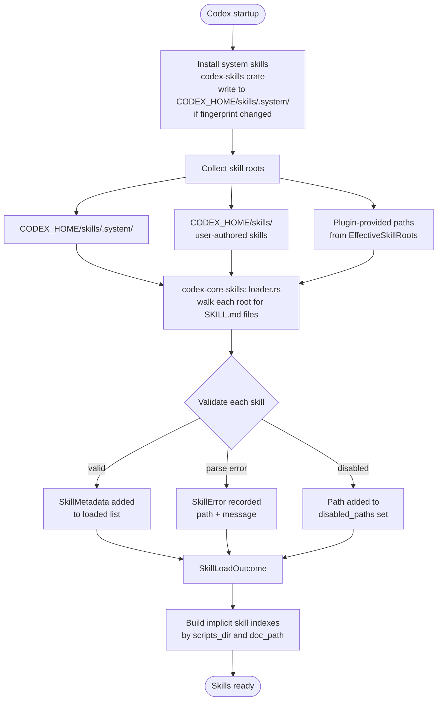
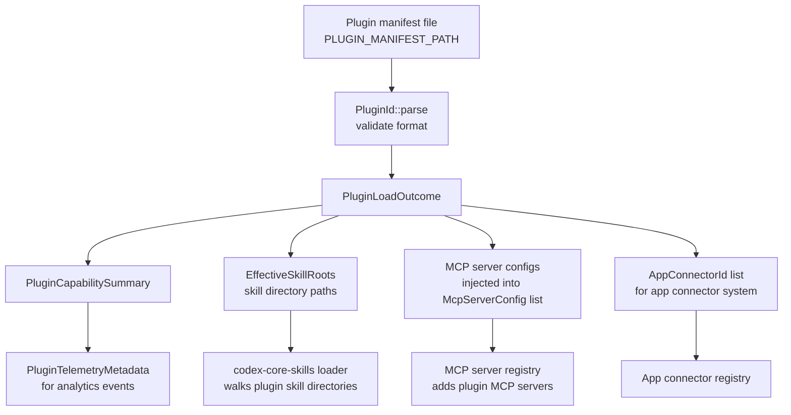

# 11 — Skills & Plugin System

> **Last updated:** references [`github.com/openai/codex`](https://github.com/openai/codex) `main` branch.  
> **Related docs:** [Core Engine](01-core-engine.md) · [Config & State](10-config-state.md) · [Observability](12-observability.md)

---

## Overview

Codex's extensibility model has two tiers:

- **Skills** are markdown-driven instruction packages that shape how the agent approaches specific tasks. They can be system-provided (embedded in the binary), user-authored (placed in `CODEX_HOME/skills/`), or plugin-provided.
- **Plugins** are self-contained extension bundles that can contribute skill directories, MCP server configurations, and app connector IDs through a standardised manifest.

The two systems are designed to compose: a plugin installs new skill roots and MCP server configs that are discovered and loaded by the same skill loading pipeline used for built-in content.

---

## Skill Loading Flow



`SkillsManager` owns the full loaded state and exposes the `SkillLoadOutcome` to the rest of the runtime. Errors do not abort loading; they are surfaced in the TUI's `/skills` view and in startup logs so users can diagnose malformed skill files without losing access to working skills.

---

## Skill Metadata Model

Each successfully loaded skill is represented by `SkillMetadata`:

| Field | Type | Description |
|---|---|---|
| `name` | `String` | Canonical name used in slash commands and prompt injection |
| `description` | `String` | Full description injected into the system prompt |
| `short_description` | `Option<String>` | One-line summary for menus |
| `interface` | `Option<SkillInterface>` | UI presentation metadata |
| `dependencies` | `Option<SkillDependencies>` | Required MCP tools |
| `policy` | `Option<SkillPolicy>` | Invocation policy controls |
| `path_to_skills_md` | `PathBuf` | Filesystem path to the `SKILL.md` declaration file |
| `scope` | `SkillScope` | `System`, `User`, or `Plugin` |

**`SkillPolicy`**

| Field | Type | Description |
|---|---|---|
| `allow_implicit_invocation` | `Option<bool>` | Whether the model may invoke this skill without an explicit user command (default: `true`) |
| `products` | `Vec<Product>` | Product restrictions; empty means unrestricted |

**`SkillInterface`**

| Field | Type | Description |
|---|---|---|
| `display_name` | `Option<String>` | Human-readable name shown in UI |
| `short_description` | `Option<String>` | Short label for compact views |
| `icon_small` | `Option<PathBuf>` | Small icon asset path |
| `icon_large` | `Option<PathBuf>` | Large icon asset path |
| `brand_color` | `Option<String>` | Hex colour for branding |
| `default_prompt` | `Option<String>` | Pre-filled prompt when skill is selected |

**`SkillDependencies` / `SkillToolDependency`**

`SkillDependencies` holds a `Vec<SkillToolDependency>`. Each dependency declares a required MCP tool by `type` and `value`, with optional `description`, `transport`, `command`, and `url` fields. The loader uses these declarations to check whether required tooling is available and may prompt installation if `Feature::SkillMcpDependencyInstall` is enabled.

---

## System Skills

System skills are embedded at compile time using the `include_dir!` macro pointing at `codex-rs/skills/src/assets/samples/`. On every startup the `codex-skills` crate checks whether the on-disk cache at `CODEX_HOME/skills/.system/` is current:

1. Compute a fingerprint over all embedded file paths and content hashes (with a salt constant `"v1"`).
2. Read the marker file at `CODEX_HOME/skills/.system/.codex-system-skills.marker`.
3. If the fingerprint matches, skip extraction. Otherwise, delete the existing `.system/` directory and re-extract the embedded content.

This ensures system skills are always in sync with the binary without incurring disk I/O on every launch after the first.

**`skill-creator`** is the primary system skill. It provides the model with instructions and scripts for scaffolding new skill directories from scratch, allowing users to create custom skills through a conversation.

---

## User Skills

Users place custom skills in `CODEX_HOME/skills/` (typically `~/.codex/skills/`). Each skill lives in its own subdirectory containing a `SKILL.md` file.

**Minimum viable skill directory:**

```
~/.codex/skills/
  my-skill/
    SKILL.md          # required: skill declaration
    scripts/          # optional: helper scripts referenced by SKILL.md
```

**`SKILL.md` structure:**

The file is a markdown document. The loader reads a YAML or TOML front-matter block for structured metadata (name, description, interface, dependencies, policy) and treats the body as the instruction content injected into the system prompt.

Skills discovered in `CODEX_HOME/skills/` receive `SkillScope::User`. They appear in the `/skills` TUI menu alongside system skills and can be enabled or disabled per-session.

---

## Skill Invocation

### Explicit Invocation

A user selects a skill via the `/skills` slash command. The TUI presents a picker of all enabled skills. On selection, the skill's instruction content is injected into the current thread's context as a `<skill>` block.

### Implicit Invocation

If `SkillPolicy::allow_implicit_invocation` is `true` (the default), the model may reference or activate the skill based on contextual relevance without an explicit user command. The `SkillLoadOutcome::allowed_skills_for_implicit_invocation()` method returns only the skills eligible for this path.

### Prompt Injection

Skills are injected as `<skill name="...">...</skill>` XML blocks embedded in `ResponseItem::Message` items. The injection module (`core-skills/src/injection.rs`) handles formatting and ordering to ensure skill context appears at the right position in the conversation history without conflating it with user turns.

---

## Plugin Architecture



`PluginId` is a validated, unique identifier for a plugin. `validate_plugin_segment()` enforces the allowed character set. A `LoadedPlugin` combines the parsed `PluginId` with the resolved `PluginCapabilitySummary`.

The `PLUGIN_MANIFEST_PATH` constant (from `codex-utils-plugins`) provides the standard filesystem path where the plugin manager looks for manifests.

---

## Plugin Capability Model

`PluginCapabilitySummary` describes everything a plugin contributes to the Codex runtime:

| Field | Type | Description |
|---|---|---|
| `config_name` | `String` | The config-layer key name for this plugin |
| `display_name` | `String` | Human-readable plugin name |
| `description` | `Option<String>` | Short description shown in `/plugins` |
| `has_skills` | `bool` | Whether the plugin provides any skill directories |
| `mcp_server_names` | `Vec<String>` | Names of MCP servers contributed by this plugin |
| `app_connector_ids` | `Vec<AppConnectorId>` | App connector IDs contributed by this plugin |

`EffectiveSkillRoots` is the resolved set of skill directory paths provided by all currently loaded plugins, used as additional roots by the skill loader.

---

## Plugin Telemetry

Every plugin lifecycle event is tracked via `PluginTelemetryMetadata`:

| Field | Type | Description |
|---|---|---|
| `plugin_id` | `PluginId` | Unique plugin identifier |
| `capability_summary` | `Option<PluginCapabilitySummary>` | Capabilities at time of event (may be absent if loading failed) |

Tracked lifecycle states:

| State | When emitted |
|---|---|
| `installed` | Plugin successfully installed |
| `uninstalled` | Plugin removed |
| `enabled` | Plugin enabled in config |
| `disabled` | Plugin disabled in config |
| `used` | A plugin tool or skill was invoked during a turn |

These events flow through `AnalyticsEventsClient` (see [12-observability.md](./12-observability.md)).

---

## MCP Skill Dependencies

Skills can declare required MCP tools in their `SkillDependencies`:

```toml
# Example SKILL.md front-matter
[dependencies.tools]
[[dependencies.tools]]
type = "mcp_tool"
value = "my-server/my-tool"
description = "Used for data retrieval"
transport = "stdio"
command = "npx my-mcp-server"
```

At load time the `env_var_dependencies` module checks whether declared environment variable dependencies are set. If `Feature::SkillEnvVarDependencyPrompt` is enabled, missing env vars trigger a prompt in the TUI asking the user to configure them. If `Feature::SkillMcpDependencyInstall` is enabled, the runtime can offer to install missing MCP servers automatically.

---

## Key Files

| File | Crate | Description |
|---|---|---|
| `codex-rs/skills/src/lib.rs` | `codex-skills` | `install_system_skills()`, fingerprint logic, `system_cache_root_dir()` |
| `codex-rs/skills/src/assets/samples/` | `codex-skills` | Embedded system skill assets (including `skill-creator`) |
| `codex-rs/core-skills/src/model.rs` | `codex-core-skills` | `SkillMetadata`, `SkillPolicy`, `SkillInterface`, `SkillDependencies`, `SkillLoadOutcome` |
| `codex-rs/core-skills/src/loader.rs` | `codex-core-skills` | SKILL.md discovery and parsing |
| `codex-rs/core-skills/src/manager.rs` | `codex-core-skills` | `SkillsManager`: owns loaded state |
| `codex-rs/core-skills/src/injection.rs` | `codex-core-skills` | Prompt injection of `<skill>` blocks |
| `codex-rs/core-skills/src/invocation_utils.rs` | `codex-core-skills` | Explicit and implicit invocation helpers |
| `codex-rs/core-skills/src/render.rs` | `codex-core-skills` | TUI rendering of skill metadata |
| `codex-rs/core-skills/src/env_var_dependencies.rs` | `codex-core-skills` | Env var dependency checking |
| `codex-rs/core-skills/src/config_rules.rs` | `codex-core-skills` | Skill-level config rule evaluation |
| `codex-rs/plugin/src/lib.rs` | `codex-plugin` | `PluginId`, `PluginCapabilitySummary`, `PluginTelemetryMetadata`, `AppConnectorId` |
| `codex-rs/plugin/src/load_outcome.rs` | `codex-plugin` | `LoadedPlugin`, `PluginLoadOutcome`, `EffectiveSkillRoots` |
| `codex-rs/plugin/src/plugin_id.rs` | `codex-plugin` | `PluginId` parsing and validation |

---

## Integration Points

- **Configuration**: `SkillsConfig` and `BundledSkillsConfig` are loaded by the config layer described in [10-config-state.md](./10-config-state.md).
- **MCP**: Skill dependencies reference MCP tools; plugin-provided MCP server configs feed into the MCP registry described in [01-core-engine.md](./01-core-engine.md).
- **TUI**: The `/skills` slash command and skill picker overlay are implemented in `codex-tui` — see [09-ui-cli-tui.md](./09-ui-cli-tui.md).
- **Analytics**: Plugin lifecycle events (`installed`, `used`, etc.) are emitted through the analytics pipeline described in [12-observability.md](./12-observability.md).
- **Instructions**: `SkillInstructions` injection into the system prompt is handled by `codex-instructions` as described in [10-config-state.md](./10-config-state.md).
