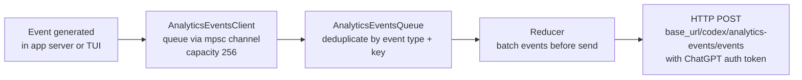
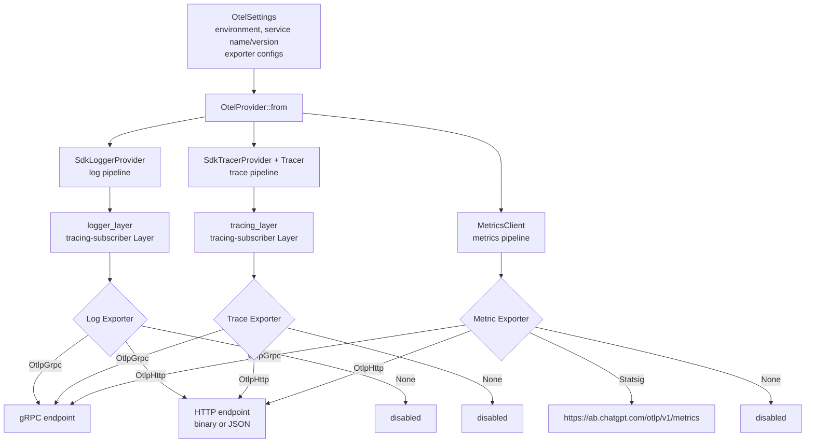
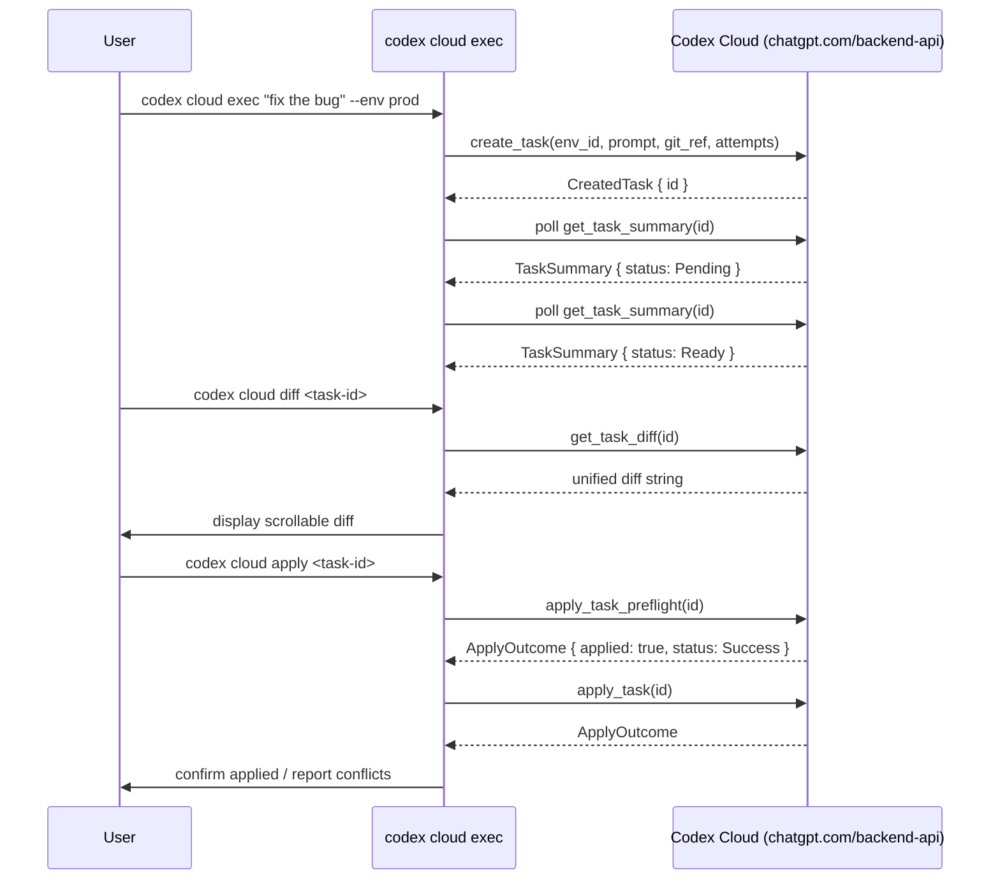
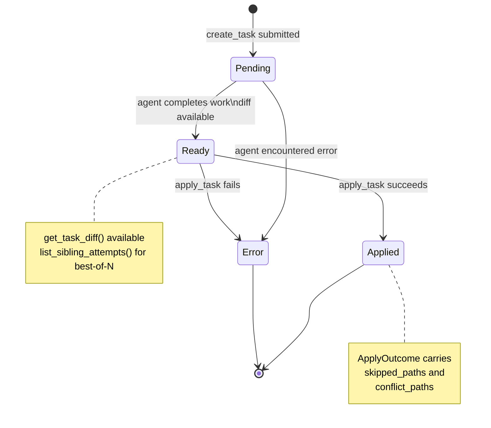

# 12 — Analytics, Telemetry & Cloud

> **Last updated:** references [`github.com/openai/codex`](https://github.com/openai/codex) `main` branch.  
> **Related docs:** [Core Engine](01-core-engine.md) · [Config & State](10-config-state.md) · [Skills & Plugins](11-skills-plugins.md)

---

## Overview

Four systems handle observability and remote operations:

1. **Analytics** (`codex-analytics`): Batched, deduplicated event tracking sent to the ChatGPT analytics endpoint.
2. **OpenTelemetry** (`codex-otel`): Structured traces, logs, and metrics exported via OTLP gRPC, OTLP HTTP, or Statsig.
3. **Feedback** (`codex-feedback`): A ring-buffer log capture that uploads full-fidelity diagnostics to Sentry when users submit feedback.
4. **Cloud Tasks** (`codex-cloud-tasks`, `codex-cloud-tasks-client`): A TUI and CLI for submitting coding tasks to Codex Cloud and applying their diffs locally.

---

## Analytics Pipeline



`AnalyticsEventsClient` owns an `mpsc` sender with a fixed capacity of 256. Producers call non-blocking send methods; if the channel is full the event is dropped silently to avoid backpressure on the agent. The `AnalyticsEventsQueue` maintains deduplicate sets keyed on event type and relevant context to prevent identical events from being emitted repeatedly within a short window. A reducer batches accumulated events into a single HTTP request before dispatch.

`TrackEventsContext` carries per-turn metadata (`turn_id` and related fields) that is attached to events requiring session context.

---

## Analytics Event Catalog

| Event | Method | Description |
|---|---|---|
| `codex.thread.initialized` | `track_initialize` | Thread created (new / forked / resumed), with model, OS, arch, app server transport |
| `codex.skill.invocation` | `track_skill_invocations` | Skill invoked explicitly or implicitly; carries skill ID, scope, invoke type, model |
| `codex.app.mentioned` | `track_app_mentioned` | An app connector was @-mentioned in the composer |
| `codex.app.used` | `track_app_used` | An app connector tool was called during a turn |
| `codex.plugin.used` | `track_plugin_used` | A plugin's skill or MCP tool was used in a turn |
| `codex.plugin.installed` | `track_plugin_installed` | Plugin installation completed |
| `codex.plugin.uninstalled` | `track_plugin_uninstalled` | Plugin removed |
| `codex.plugin.enabled` | `track_plugin_enabled` | Plugin enabled in config |
| `codex.plugin.disabled` | `track_plugin_disabled` | Plugin disabled in config |

All events are serialised as `TrackEventsRequest` containing a `Vec<TrackEventRequest>` (an untagged enum covering all event variants). Authentication uses the ChatGPT Bearer token managed by `codex-login`.

### `TrackEventsContext` Fields

| Field | Description |
|---|---|
| `turn_id` | ID of the current agent turn |
| `thread_id` | ID of the current conversation thread |
| `model_slug` | Model identifier |
| `product_client_id` | Client product identifier |

---

## OpenTelemetry Integration



`OtelProvider` is the singleton holder for all three OpenTelemetry sub-systems. Each sub-system uses an independent `OtelExporter` configuration, allowing logs, traces, and metrics to be routed to different backends.

`SessionTelemetry` (`otel/src/events/session_telemetry.rs`) wraps per-session metadata and emits structured events at session start and end. `Timer` provides a simple stop-watch utility backed by the metrics client. `RuntimeMetricTotals` accumulates CPU and memory samples via a manual reader when `Feature::RuntimeMetrics` is enabled.

---

## Supported OTel Exporters

| Exporter | Transport | Format | Use case |
|---|---|---|---|
| `None` | — | — | Disable the pipeline (default in debug builds for Statsig) |
| `OtlpGrpc` | gRPC (tonic) | Protobuf binary | Production self-hosted or vendor OTLP collector |
| `OtlpHttp { protocol: Binary }` | HTTP | Protobuf binary | OTLP/HTTP binary format |
| `OtlpHttp { protocol: Json }` | HTTP | JSON | OTLP/HTTP JSON format; used by Statsig internally |
| `Statsig` | HTTP (resolves to `OtlpHttp/Json`) | JSON | Metrics to ChatGPT Statsig endpoint; disabled in debug builds |

Both gRPC and HTTP exporters support optional TLS configuration (`OtelTlsConfig`) with CA certificate, client certificate, and client private key fields.

`OtelSettings` carries `exporter` (logs), `trace_exporter`, and `metrics_exporter` fields independently, so the three pipelines can be configured with different exporters.

---

## Feedback & Sentry Integration

`CodexFeedback` provides a ring-buffer log capture layer that records all log output regardless of the user's `RUST_LOG` setting, so feedback reports always include full diagnostics.

### Architecture

```
CodexFeedback
│
├─ Ring buffer (4 MiB default)
│   └─ FeedbackMakeWriter: all tracing events written here
│       (captures TRACE level regardless of RUST_LOG)
│
├─ FeedbackMetadataLayer
│   └─ Collects key/value tags from target="feedback_tags" events
│       (max 64 tags)
│
└─ snapshot() → FeedbackSnapshot
    ├─ logs: Vec<u8> (raw ring buffer bytes)
    ├─ tags: BTreeMap<String, String>
    └─ diagnostics: FeedbackDiagnostics
```

`FeedbackSnapshot` is constructed on demand when the user submits feedback via `/feedback`. It bundles the ring-buffer contents, structured tags, and `FeedbackDiagnostics` (connectivity checks and environment info).

### Classification Types

| Classification | Meaning |
|---|---|
| `bug` | Unexpected behaviour reported by the user |
| `bad_result` | Model output was incorrect or unhelpful |
| `good_result` | Positive feedback |
| `safety_check` | Safety-related concern |

Snapshots are uploaded to Sentry DSN `ae32ed50...` with a 10-second timeout. The `FEEDBACK_DIAGNOSTICS_ATTACHMENT_FILENAME` constant names the diagnostics attachment within the Sentry envelope.

---

## Cloud Tasks Architecture

`codex cloud` connects to Codex Cloud to submit coding tasks, monitor their progress, inspect diffs, and apply patches to the local working tree.



`BackendContext` wraps the `CloudBackend` trait implementation with the resolved base URL. In debug builds, setting `CODEX_CLOUD_TASKS_MODE=mock` replaces the HTTP client with `MockClient` from `codex-cloud-tasks-mock-client`.

The default base URL is `https://chatgpt.com/backend-api`. An alternate URL can be injected via `CODEX_CLOUD_TASKS_BASE_URL`.

---

## Cloud Task Lifecycle



`AttemptStatus` (for individual best-of-N attempts): `Pending` → `InProgress` → `Completed` / `Failed` / `Cancelled` / `Unknown`.

---

## Cloud Tasks CLI Reference

| Command | Description | Key Options |
|---|---|---|
| `codex cloud` | Launch interactive TUI for browsing tasks | — |
| `codex cloud exec <QUERY>` | Submit a new task without launching TUI | `--env ENV_ID` (required), `--attempts 1-4`, `--branch BRANCH` |
| `codex cloud status <TASK_ID>` | Show task status | — |
| `codex cloud list` | List tasks | `--env ENV_ID`, `--limit 1-20`, `--cursor CURSOR`, `--json` |
| `codex cloud diff <TASK_ID>` | Display unified diff | `--attempt N` |
| `codex cloud apply <TASK_ID>` | Apply diff to local working tree | `--attempt N` |

`--attempts` controls best-of-N: the agent produces N independent solutions and all are available for inspection. `--branch` overrides the git ref used for the cloud run (defaults to current branch).

---

## `CloudBackend` Trait

`CloudBackend` is the abstraction over real HTTP and mock backends:

```
trait CloudBackend: Send + Sync {
    list_tasks(env, limit, cursor) → TaskListPage
    get_task_summary(id) → TaskSummary
    get_task_diff(id) → Option<String>
    get_task_messages(id) → Vec<String>
    get_task_text(id) → TaskText
    list_sibling_attempts(task, turn_id) → Vec<TurnAttempt>
    apply_task_preflight(id, diff_override) → ApplyOutcome
    apply_task(id, diff_override) → ApplyOutcome
    create_task(env_id, prompt, git_ref, qa_mode, best_of_n) → CreatedTask
}
```

`apply_task_preflight` is a dry-run that validates patch applicability without modifying the working tree. It accepts a `diff_override` so callers can test alternate attempts without re-fetching.

**`TaskStatus` enum:** `Pending` | `Ready` | `Applied` | `Error`

**`ApplyOutcome` fields:**

| Field | Type | Description |
|---|---|---|
| `applied` | `bool` | Whether the patch was applied |
| `status` | `ApplyStatus` | `Success` / `Partial` / `Error` |
| `message` | `String` | Human-readable result summary |
| `skipped_paths` | `Vec<String>` | Files skipped (binary or not found) |
| `conflict_paths` | `Vec<String>` | Files with merge conflicts |

---

## Key Files

| File | Crate | Description |
|---|---|---|
| `codex-rs/analytics/src/lib.rs` | `codex-analytics` | `AnalyticsEventsClient`, `TrackEventsContext` |
| `codex-rs/analytics/src/client.rs` | `codex-analytics` | mpsc channel, dedup, HTTP send |
| `codex-rs/analytics/src/events.rs` | `codex-analytics` | All `TrackEventRequest` variants and serialisation |
| `codex-rs/analytics/src/reducer.rs` | `codex-analytics` | Batching reducer before HTTP dispatch |
| `codex-rs/analytics/src/facts.rs` | `codex-analytics` | `SkillInvocation`, `AppInvocation`, `PluginState` |
| `codex-rs/otel/src/lib.rs` | `codex-otel` | `OtelProvider`, `SessionTelemetry`, `Timer`, `TelemetryAuthMode` |
| `codex-rs/otel/src/config.rs` | `codex-otel` | `OtelSettings`, `OtelExporter`, `OtelHttpProtocol`, `OtelTlsConfig` |
| `codex-rs/otel/src/provider.rs` | `codex-otel` | `OtelProvider::from()` construction |
| `codex-rs/otel/src/metrics/` | `codex-otel` | `MetricsClient`, `RuntimeMetricTotals`, `Timer` |
| `codex-rs/feedback/src/lib.rs` | `codex-feedback` | `CodexFeedback`, `FeedbackSnapshot`, ring buffer, Sentry upload |
| `codex-rs/feedback/src/feedback_diagnostics.rs` | `codex-feedback` | `FeedbackDiagnostics`, connectivity checks |
| `codex-rs/cloud-tasks/src/lib.rs` | `codex-cloud-tasks` | Task submission, polling, diff, apply orchestration |
| `codex-rs/cloud-tasks/src/cli.rs` | `codex-cloud-tasks` | `Cli`, `ExecCommand`, `StatusCommand`, `ListCommand`, `ApplyCommand`, `DiffCommand` |
| `codex-rs/cloud-tasks-client/src/api.rs` | `codex-cloud-tasks-client` | `CloudBackend` trait, all model types |
| `codex-rs/cloud-tasks-client/src/http.rs` | `codex-cloud-tasks-client` | `HttpClient` implementation |
| `codex-rs/cloud-requirements/src/` | `codex-cloud-requirements` | Cloud/org constraint types |

---

## Integration Points

- **Authentication**: Analytics HTTP requests and cloud task requests use the ChatGPT auth token managed by `codex-login` — see [06-auth-login.md](./06-auth-login.md).
- **Feature flags**: `Feature::GeneralAnalytics` gates thread lifecycle analytics; `Feature::RuntimeMetrics` gates runtime metric sampling — see [10-config-state.md](./10-config-state.md).
- **Plugins**: Plugin lifecycle events (`installed`, `used`, etc.) are emitted through `AnalyticsEventsClient` — see [11-skills-plugins.md](./11-skills-plugins.md).
- **TUI**: The `/feedback` slash command triggers `CodexFeedback::snapshot()` and the Sentry upload — see [09-ui-cli-tui.md](./09-ui-cli-tui.md).
- **Rollout**: Session JSONL files recorded by `codex-rollout` (described in [10-config-state.md](./10-config-state.md)) are a prerequisite for the state DB backfill pipeline that feeds thread analytics.
